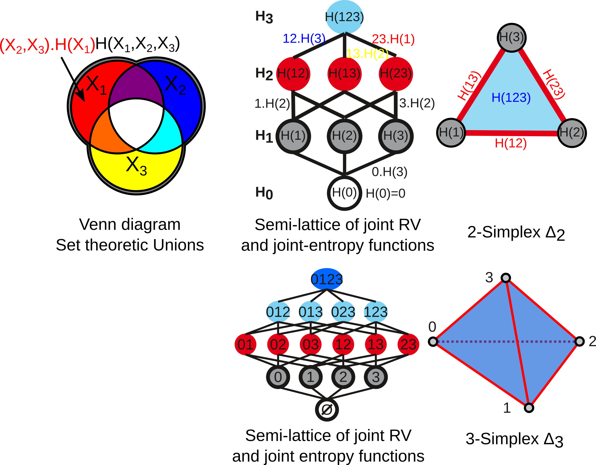
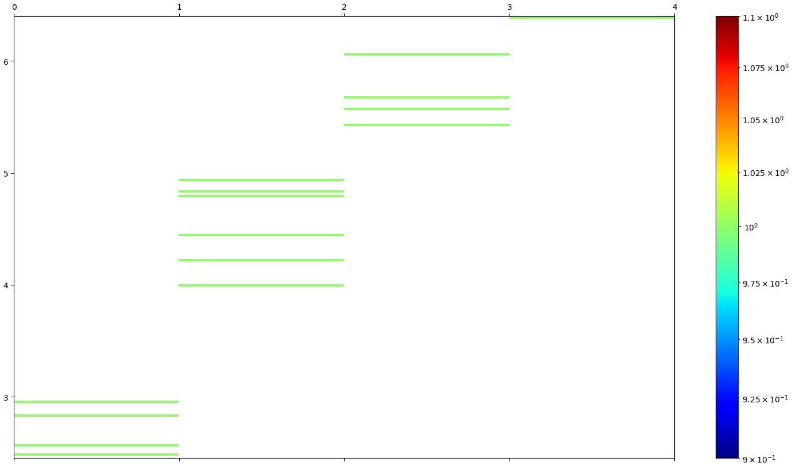
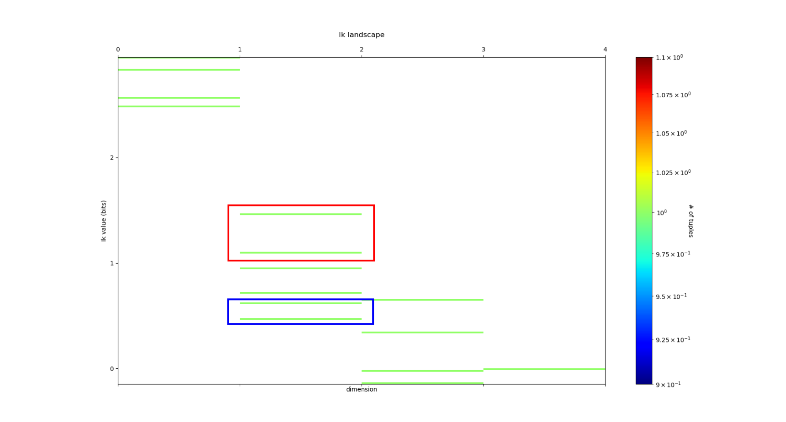
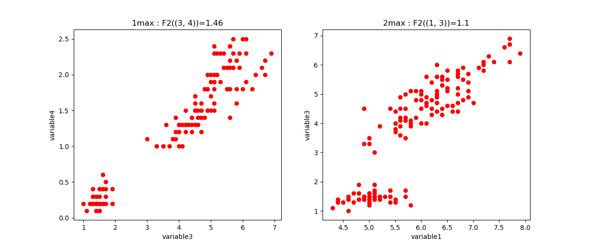
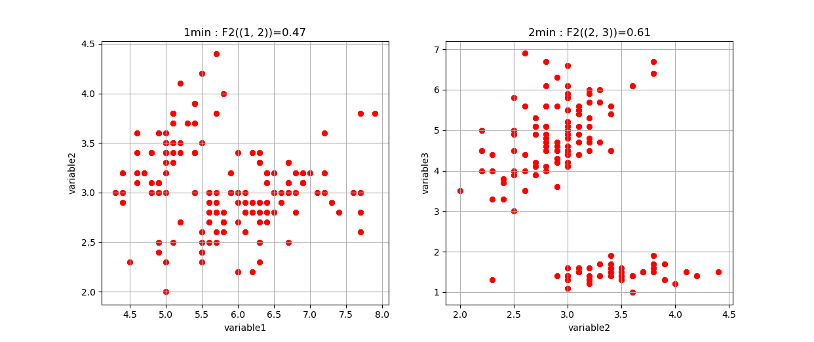
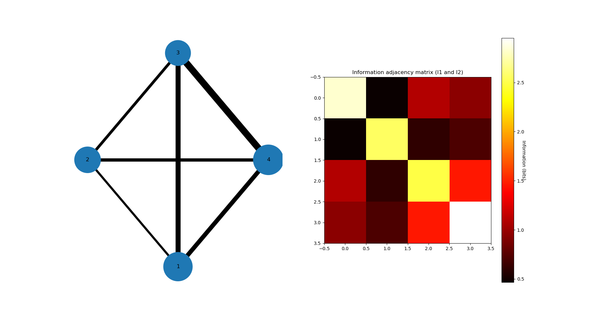
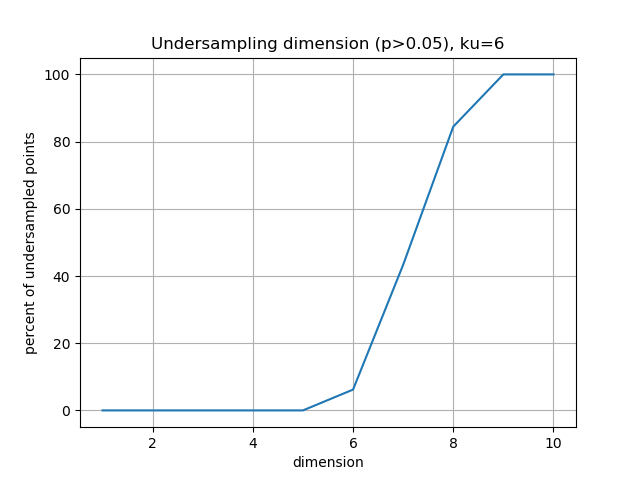
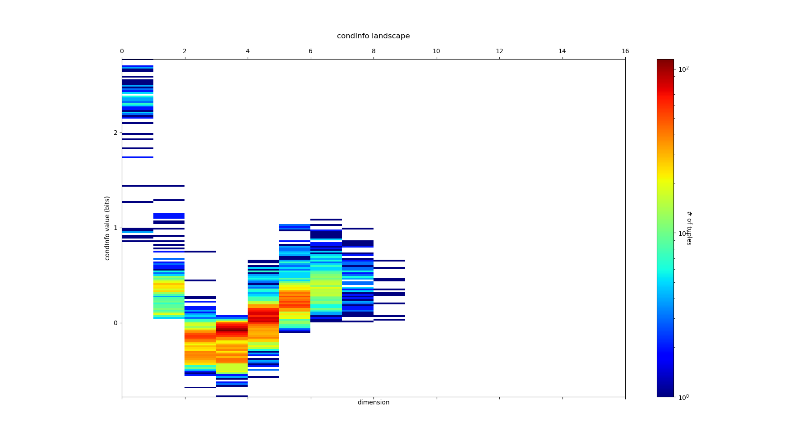

How to Use InfoTopo
===================

Infotopo is a general Machine Learning set of tools gathering Topology 
(Cohomology and Homotopy), statistics and information theory 
(information quantifies statistical structures generically) and 
statistical physics.
It provides a matheamticaly formalised expression of deep network and learning,
and propose anuspervised or supervised learning mode (as a special case of the first).
It allows a simple and autonatic exploration of the data structures, dimension reduction
and supervised or unsupervised classification.

The raw methods are computationnally consuming due to the intrinsic combinatorial 
nature of the topological tools, even in the simplest case of a simplicial case 
(the general case is based on the much broader partition combinatorics) the 
computational complexity is of the order of :math:`2^n` .
As a consequence, an important part of the tools and methods are dedicated 
to overcome this extensive computation. Among the possible strategies and 
heuristics used or currently developped, are:

_ restrict to simplicial cohomology and combinatorics (done here).

_ possible exploration of only the low dimensional structures (done here).

_ possible exploration of only most or least informative paths (done here).

_ possible restriction 2nd degree-dimension statistical interactions: 
what is computed here is the equivalent of the Cech complex (with all degree-
dimension computed), and such restriction is equivalent to computing the Vietoris-Rips 
complex (in development). 

_ compute on GPU (in development).

As a result, for this 0.1 version of the software, and for computation with 
commercial average PC, we recommand to analyse up to 20 variables (or dimensions)
at a time in the raw brut-force approach (see performance section).

We now present some basic example of use, inspiring our presentation from 
the remarkable presentation of `UMAP by McInnes. <https://umap-learn.readthedocs.io/en/latest/>`_
We first import some few tools: some of the datasets available in sklearn, seaborn to
visualise the results, and pandas to handle the data.

.. code:: python3

    from sklearn.datasets import load_iris, load_digits, load_boston, load_diabetes
    import pandas as pd
    import seaborn as sns
    import matplotlib.pyplot as plt
    import timeit

.. code:: python3

    sns.set(style='white', context='notebook', rc={'figure.figsize':(14,10)})

Iris data
---------

Iris dataset
~~~~~~~~~~~~

The first example of dataset application we will present is the `iris
dataset <https://en.wikipedia.org/wiki/Iris_flower_data_set>`__. It is
a very small dataset composed of 4 Random-Variables or dimensions that 
quantify various petals and sepals observables of 3 different species of 
Iris flowers, like petal length, for 150 flowers or points (50 for each 
species). In the context of Infotopo it means that dimension_tot = 4  
and sample_size = 150 (we consider all the points), and as the dimension
of the data set is small we will make the complete analysis of the 
simplicial structure of dependencies by setting the maximum dimension 
of analysis to dimension_max = dimension_tot. We also set the other 
parameters of infotopo to approriate, as further explained.   
We can load the iris dataset from sklearn.

.. code:: python3

    iris = load_iris()
    iris_df = pd.DataFrame(iris.data, columns = iris.feature_names)
    print(iris.DESCR)

    dimension_max = iris.data.shape[1]
    dimension_tot = iris.data.shape[1]
    sample_size = iris.data.shape[0]
    nb_of_values =9
    forward_computation_mode = False
    work_on_transpose = False
    supervised_mode = False
    sampling_mode = 1
    deformed_probability_mode = False
    

.. parsed-literal::

    Iris Plants Database
    ====================
    
    Notes
    -----
    Data Set Characteristics:
        :Number of Instances: 150 (50 in each of three classes)
        :Number of Attributes: 4 numeric, predictive attributes and the class
        :Attribute Information:
            - sepal length in cm
            - sepal width in cm
            - petal length in cm
            - petal width in cm
            - class:
                    - Iris-Setosa
                    - Iris-Versicolour
                    - Iris-Virginica
        :Summary Statistics:
    
        ============== ==== ==== ======= ===== ====================
                        Min  Max   Mean    SD   Class Correlation
        ============== ==== ==== ======= ===== ====================
        sepal length:   4.3  7.9   5.84   0.83    0.7826
        sepal width:    2.0  4.4   3.05   0.43   -0.4194
        petal length:   1.0  6.9   3.76   1.76    0.9490  (high!)
        petal width:    0.1  2.5   1.20  0.76     0.9565  (high!)
        ============== ==== ==== ======= ===== ====================
    
        :Missing Attribute Values: None
        :Class Distribution: 33.3% for each of 3 classes.
        :Creator: R.A. Fisher
        :Donor: Michael Marshall (MARSHALL%PLU@io.arc.nasa.gov)
        :Date: July, 1988
    
    This is a copy of UCI ML iris datasets.
    http://archive.ics.uci.edu/ml/datasets/Iris
    
    The famous Iris database, first used by Sir R.A Fisher
    
    This is perhaps the best known database to be found in the
    pattern recognition literature.  Fisher's paper is a classic in the field and
    is referenced frequently to this day.  (See Duda & Hart, for example.)  The
    data set contains 3 classes of 50 instances each, where each class refers to a
    type of iris plant.  One class is linearly separable from the other 2; the
    latter are NOT linearly separable from each other.
    
    References
    ----------
       - Fisher,R.A. "The use of multiple measurements in taxonomic problems"
         Annual Eugenics, 7, Part II, 179-188 (1936); also in "Contributions to
         Mathematical Statistics" (John Wiley, NY, 1950).
       - Duda,R.O., & Hart,P.E. (1973) Pattern Classification and Scene Analysis.
         (Q327.D83) John Wiley & Sons.  ISBN 0-471-22361-1.  See page 218.
       - Dasarathy, B.V. (1980) "Nosing Around the Neighborhood: A New System
         Structure and Classification Rule for Recognition in Partially Exposed
         Environments".  IEEE Transactions on Pattern Analysis and Machine
         Intelligence, Vol. PAMI-2, No. 1, 67-71.
       - Gates, G.W. (1972) "The Reduced Nearest Neighbor Rule".  IEEE Transactions
         on Information Theory, May 1972, 431-433.
       - See also: 1988 MLC Proceedings, 54-64.  Cheeseman et al"s AUTOCLASS II
         conceptual clustering system finds 3 classes in the data.
       - Many, many more ...
    

As visualizing data in 4 dimensions or more is hard or not possible, we can first 
plot all the pairwise scatterplot matrix to present the pairwise correlations and 
dependencies between the variables, using Seaborn and pandas dataframe.

.. code:: python3

    iris_df = pd.DataFrame(iris.data, columns=iris.feature_names)
    iris_df['species'] = pd.Series(iris.target).map(dict(zip(range(3),iris.target_names)))
    sns.pairplot(iris_df, hue='species')
    plt.show()

.. image:: images/iris_pairwise_scatter.png

All those 2D views gives a rought but misleading idea of what the data looks 
like in high dimensions since, as we will see, some fully emergent  
statistical dependences (called synergy in the original work of Bialek's team) can appear in higher dimension which are 
totally unobservable in those 2D views. However such 2D views gives a fair
visual estimation of how much each pairs of variale covary, the correlation 
coefficient and its generalization to non-linear relations, the pairwise 
Mutual Information (I2). In Topological Data Analysis (TDA) terms, it gives rought 
idea of what the skeleton of a Vietoris-Rips (information or correlation) complex
of the data could be.
We will see how to go beyond this pairwise statistical interaction case, and how
we can unravel some purely emergent higher dimensional interations. Along this 
way, we will see how to compute and estimate all classical information functions,
multivariate Entropies, Mutual Informations and Conditional Entropies and 
Mutual Informations. 

Entropy
~~~~~~~

To use infotopo we need to first construct a infotopo object from 
the infotopo package. This makes a lot of same word, information is a 
functor, a kind of general application or map, that could be either a 
function or a class. So let's first import the infotopo library, we a set 
of specifications of the parametters (cf. section parameters, some of them 
like dimension_max = dimension_tot and sample_size have been fixed 
previously to the size of the data input matrix).

.. code:: python3

    import infotopo

.. code:: python3

    information_topo = infotopo.infotopo(dimension_max = dimension_max, 
                                dimension_tot = dimension_tot, 
                                sample_size = sample_size, 
                                work_on_transpose = work_on_transpose,
                                nb_of_values = nb_of_values, 
                                sampling_mode = sampling_mode, 
                                deformed_probability_mode = deformed_probability_mode,
                                supervised_mode = supervised_mode, 
                                forward_computation_mode = forward_computation_mode)

Now we will compute all the simplicial semi-lattice of marginal and joint-entropy, 
that contains :math:`2^n` elements including the unit 0 reference measure element. 
The marginal :math:`H_1` entopies are defined as classicaly by `Shannon <https://www.google.com/url?sa=t&rct=j&q=&esrc=s&source=web&cd=&cad=rja&uact=8&ved=2ahUKEwjtrqOXrsPrAhVCrxoKHcBDBrQQgAMoAHoECBIQAg&url=http%3A%2F%2Fscholar.google.fr%2Fscholar_url%3Furl%3Dhttps%3A%2F%2Fpure.mpg.de%2Frest%2Fitems%2Fitem_2383162_7%2Fcomponent%2Ffile_2456978%2Fcontent%26hl%3Dfr%26sa%3DX%26scisig%3DAAGBfm2dgGR4Ly92eRCfhrM1BgCnbIBvBA%26nossl%3D1%26oi%3Dscholarr&usg=AOvVaw0ha99XPEPwgTiv3oMC7PTE>`_ :

.. math::	
    H_1=H(X_{j};P)=k\sum_{x \in [N_j] }p(x)\ln p(x) 

and the multivariate joint-entropies :math:`H_k` just generalise the preceding to k variables:

.. math::	
    H_k= H(X_{1},...,X_{k};P)=  k\sum_{x_1,...,x_k\in [N_1\times...\times N_k]}^{N_1\times...\times N_k}p(x_1.....x_k)\ln p(x_1.....x_k)     

The figure below give the usual Venn diagrams representation of set theoretic unions 
and the corresponding semi-lattice of joint Random Variables and Joint Entropies, together 
with its correponding simplicial representation, for 3 (top) and 4 variables-dimension 
(bottom, the case of the iris dataset with 2 power 4 joint random variables). This correspondence
of joint-information with the semi-lattice of union was formalized by `Hu Kuo Ting <https://drive.google.com/file/d/10ZMjN8Q4w6t4osaYODdBg-pF9zlu21R_/view?usp=sharing>`_ . 
The edges of the lattice are in one to one correspondence with conditional entropies.   

To do this we will call simplicial_entropies_decomposition, that gives in output 
all the joint entropies in the form of a dictionary with keys given by the tuple of 
the joint variables (ex: (1,3,4)) and  with values the joint or marginal entropy in bit 
(presented below).

.. code:: python3

    Nentropie = information_topo.simplicial_entropies_decomposition(iris.data)

.. parsed-literal::

    {(4,): 2.9528016441309237, (3,): 2.4902608474907497, (2,): 2.5591245822618114, (1,): 2.8298425472847066, (3, 4): 3.983309507504916, (2, 4): 4.798319817958397, (1, 4): 4.83234271597051, (2, 3): 4.437604597473526, (1, 3): 4.2246575340121835, (1, 2): 4.921846615158947, (2, 3, 4): 5.561696151051504, (1, 3, 4): 5.426426190681815, (1, 2, 4): 6.063697650692486, (1, 2, 3): 5.672729631265195, (1, 2, 3, 4): 6.372515544003377}

Such dictionary is hard to read; to allow a relevant visualization of the
the simplicial entropy structure, the function simplicial_entropies_decomposition
also plots the Entropy landscapes. Entropy landscapes provides a representation of the lattice 
of joint (:math:`H_k`) and conditional entropies (noted as the action of Y :math:`Y.H_k`, 
for :math:`H(X_1,...,X_k|Y)`) that ranks the joint variables as a function of their entropy value 
and of the rank-dimensions as illustrated in the figure below:

.. image:: images/Principles_TIDA.png

An Entropy of Information Path is a sequence of inclusive tuples of increasing dimensions and follows 
the edges of the semi-lattice, and the slope of such a path is exactly minus the conditional-entropy, 
as a basic representation of the fundamental chain rule of Entropy.

While the total dimension n (dimension_tot) of the analysis increases, the number of subsets of k 
variables (or k-tuples) increases combinatorially, following the binomial coefficient C(n,k). 
It hence becomes rapidly fully impractical to vizualize, plot and to differentiate the C(n,k) values of 
entropy obtained in dimension k. The Entropy landscapes hence plot the histograms of entropy values as a 
function of the dimension-rank k, and the number of bins of the histograms is imposed by the parameter 
nb_bins_histo. The count of the number of subsets having entropy values in the bin range of the histograms
is represented by a color code in the entropy landscapes. Hence, Entropy Landscapes shall be understood as
(unormalised..but it could be normalised) entropy measure densities histograms (there is interesting further
theoretical and applied development upon this point, since entropy functions obey axioms of measure: one 
could legitamely investigate entropies of entropies, a kind of complexity of information landscapes, see
`Hsu et al. <https://www.mdpi.com/1099-4300/19/10/550>`_ ). 

To plot the Entropy Landscapes and the distribution of entropy values for each dimension-rank k, we use 
the "entropy_simplicial_lanscape" command as following:   

.. code:: python3 

    information_topo.entropy_simplicial_lanscape(Nentropie)

On the example of Iris dataset, the Entropy Landscape we obtain look like this: 

In this low dimensional case (dimension_tot = 4), the landscapes are very low informative (poor information 
structure) and the histrograms have low meaning, since there is only one subset-k-tuple per bin value, and hence only 
one color (here the green value of 1). The Entropy Landscape themselfs are quite poor in information, joint-entropy is
monotonically increasing along entropy path, a direct consequence of conditional-entropy positivity (concavity argument) 
which is moreover the basic fact at the origin of the basic topological expression of the 2nd law of thermodynamic [3].
As a consequence, we usually do not uncover a lot of usefull information on the datas structure from those Entropy Landscape,
at the exception of curse of dimensionality quantification and in some cases, (assymptotic) entropy rates (to do).
Basically, joint-entropy quantifies "randomness" (in a non formal definition of the word), uncertainty, or how much the 
data points spreads in the dimensions of the variables. Hence low entropies shall be intrepreted as "localised" densities
of data points or sparsness of the probability density histograms (also not in the usual kurtosis sens).  

In any entropy or information function estimation, it is necessary to check that the number of sample is sufficient to 
provide a faithfull estimate, to avoid the sampling problem also called "curse of dimension". The command 
"entropy_simplicial_lanscape" also computes the maximal dimension above which the estimation becomes too inacurate and
shall not be interpreted. This is explained in more details in the section "curse_of_dimension_and_statistical_dependencies_test". 

Mutual Information
~~~~~~~~~~~~~~~~~~

Now, let's have a look at the statistical dependencies structures in the dataset by computing the Mutual-Information lanscapes 
which principle is depicted in the preceding figure and that basically plots k-dimensional multivariate Mutual Informations (:math:`I_k`) in the same 
way as Entropy Landscapes. Pairwise Mutual Information :math:`I_2` is defined as usual following `Shannon <https://www.google.com/url?sa=t&rct=j&q=&esrc=s&source=web&cd=&cad=rja&uact=8&ved=2ahUKEwjtrqOXrsPrAhVCrxoKHcBDBrQQgAMoAHoECBIQAg&url=http%3A%2F%2Fscholar.google.fr%2Fscholar_url%3Furl%3Dhttps%3A%2F%2Fpure.mpg.de%2Frest%2Fitems%2Fitem_2383162_7%2Fcomponent%2Ffile_2456978%2Fcontent%26hl%3Dfr%26sa%3DX%26scisig%3DAAGBfm2dgGR4Ly92eRCfhrM1BgCnbIBvBA%26nossl%3D1%26oi%3Dscholarr&usg=AOvVaw0ha99XPEPwgTiv3oMC7PTE>`_ :

.. math::	
    I_2=I(X_{1};X_{2};P)=k\sum_{x_1,x_2\in[N_1\times N_2]}^{N_1\times N_2}p(x_1.x_2)\ln \frac{p(x_1)p(x_2)}{p(x_1.x_2)}

They generalize to the multivariate mutual informations, :math:`I_k`, as alternated functions of entropies, following `McGill <https://drive.google.com/file/d/1Cpem9LVFYNScAcihBnqw7IRUjnW-wU04/view?usp=sharing>`_ and `Hu Kuo Ting <https://drive.google.com/file/d/10ZMjN8Q4w6t4osaYODdBg-pF9zlu21R_/view?usp=sharing>`_.

.. math::	
    I_k(X_1,...,X_k;P)=\sum_{i=1}^{k}(-1)^{i-1}\sum_{I\subset [k];card(I)=i}H_i(X_I;P)

For example: 
.. math::
    `I_3=H(X_1)+H(X_2)+H(X_3)-H(X_1,X_2)-H(X1,X_3)-H(X_2,X_3)+H(X_1,X_2,X_3)`:    

`Hu Kuo Ting <https://drive.google.com/file/d/10ZMjN8Q4w6t4osaYODdBg-pF9zlu21R_/view?usp=sharing>`_ showed the correspondence of :math:`I_k` with set intersections
semi-lattice (of finite measurable functions), and we hence have just like with entropy the following information structure, corresponding to intections on Venn 
diagrams: 

.. image:: images/informationfunctions.png

The other functions that quantifies multivariate depence are Total Correlations, :math:`G_k` (`Watanabe <http://www.neuralmachines.com/references/correlation.pdf>`_ , see section diabetes data) 
, or total free energy, or Integrated Information (`Tononi and Edelman <http://www.neuralmachines.com/references/correlation.pdf>`_ ) which are the Kullback-Leibler Divergence between the full joint-entropy and its marginals product, 
for example, :math:`G_3=H(X_1)+H(X_2)+H(X_3)-H(X_1,X_2,X_3)`:

.. math::
    G_k= G_k(X_1;...X_k;P)=\sum_{i=1}^k H(X_i) - H(X_1;...X_k)

Whereas, :math:`G_k` quantifies the total interactions, :math:`I_k` quantify the contribution of the kth interaction. Notably, we have the theorems
that state that n variables are independent if and only if  :math:`G_n =0`, and n variables are independent if and only if  all the :math:`2^n-n-1` 
:math:`I_k` functions with :math:`k \geq 2` are null (e.g. :math:`I_k` provides a refined independence measure `PDF <https://www.mdpi.com/1099-4300/21/9/869>`_). 
In contrast with :math:`G_k`, :math:`I_k` can be negative for :math:`k \geq 3`, a phenomenon called synergy in the original study of Brenner et al.
Considering the old goal of expressing all of physics in terms of information, following Brillouin, Jaynes, Wheeller (...), for `k \geq 2`, 
:math:`G_k` corresponds to a Free-Energy functional of a k interacting body system, while the  :math:`I_k` quantifies the contribution of the 
k-bodies interaction to this total free energy. The :math:`I_1` component is the internal energy:

.. math::
    H_k(X_1,..,X_k;P_N)=E(X_1,..,X_k;P_N)-G(X_1,..,X_k;P_N)=E-G

The Free-energy decomposes itself as an alternated sum of :math:`I_k` : 

.. math::
    G_k =\sum_{i=2}^{k}(-1)^{i}\sum_{I\subset [n];card(I)=i}I_i(X_I;P)    

To plot the Information Landscapes and the distribution of :math:`I_k` values for each dimension-rank k, we use 
the "entropy_simplicial_lanscape" command as following:   

.. code:: python3 

    information_topo.mutual_info_simplicial_lanscape(Ninfomut)

On the example of Iris dataset, the Entropy Landscape we obtain look like this: 

To obtain the first m k-tuples with maximum and minimum value in dimension k, and if the dimension is 2,3 or 4 plot the data points in the 
corresponding k-subspace (the 4th dimension is represented by a color code), we use the "display_higher_lower_information".
For exmaple, plotting the 2 first maximum and minimum in dimension (framed in red and blue respectively in the last figure), we use 
the following command: 

.. code:: python3 

    information_topo = infotopo(dim_to_rank = 2, number_of_max_val = 2)
    dico_max, dico_min = information_topo.display_higher_lower_information(Ninfomut, dataset)    

On the example of Iris dataset, we obtain the two pairs of variables (3,4) and (1,3) that are the most statistically dependent ("correlated"): 

And we obtain the two pairs of variables (1,2) and (2,3) that are the less statistically dependent ("uncorrelated"):

Whenever the dimension to study is more than 4, the function only retreives the dictionaries of the first maximum and minimum tuples (to print).

Information Networks
~~~~~~~~~~~~~~~~~~~~

In biology (e.g "omic"), neuroscience (e.g "neural network") and social science (e.g "social network"), it is common and helpfull to conceive and 
visualize the one and two dimensional results as (first degree) networks. To visualize the Information Networks, we use the 
"mutual_info_pairwise_network" as following:

.. code:: python3 

    adjacency_matrix_mut_info = information_topo.mutual_info_pairwise_network(Ninfomut)

The area of each vertex is a function of the marginals information :math:`H_1=I_1` and the thickness of the edges is a function of the pairwise
mutual information or total correlation :math:`I_2=G_2`. On Iris dataset, it gives:  

The adjacency matrix of information have the marginals informations :math:`H_1=I_1` in its diagonal and is symmetric with respect to the diagonal
as the result of the commutativity of the join-variables and mutual-variables operation in classical information theory (classical is by opposition 
with quantum information theory). Compared to usual distance matrix (with given metric) computed in machine learning (for clustering or classifications),
the  :math:`I_k` are not metric (e.g. non zero diagonal and no triangle inequality), we will introduce to information metric in the next stepps. 
With such Matrix it is possible to apply some usual computational persistence homology tools like `Mapper scikit-tda <https://github.com/scikit-tda>`_ 
(created by Singh, Mémoli, and Carlsson) and to build what could be called an "informational Vietoris-Ripps complex". In the context of Morse theory,
information landscapes consider infomation functions themselfs as height or "Morse" functions. However there is likely a much more fundamental application of 
persistence theory in the construction of a local probability density estimation (to be done). :math:`I_k` with :math:`k \geq 3` can be repesented in an 
analgous way using k-cliques as acheived in `Tapia & al 2018 <https://www.nature.com/articles/s41598-018-31765-z>`_ (to be done in the package). They 
shall be represented using k-tensor formalism. In the context of complex networks studies those higher :math:`I_k` with :math:`k \geq 3` correspond to 
hypergraphs or `multiplex or multilayer networks <https://oxford.universitypressscholarship.com/view/10.1093/oso/9780198753919.001.0001/oso-9780198753919>`_
The raw result obtained here is a fully connected network, but one can obtain a sparse matrix and a sparsely connected network by thresholding 
the :math:`I_k` with a with fixed p-value, using the exact statistical dependence test implemented in the package. 

We begin to see that Homology provides a wide generalisation of complex networks (a 1-complex, that is a graph) to higher interactions structures.

Diabetes data
-------------

Diabetes dataset
~~~~~~~~~~~~~~~~

The Iris dataset and its associated information landsacpes are in too low dimension to appreciate all the interest of the methods in higher dimensions,
so lets turn to larger dimensional classical machine learning dataset: Diabetes dataset. This dataset is kindly also furnished by scikitlearn, and we load it with the same methods as previously:

.. code:: python3 

    dataset = load_diabetes()
    dataset_df = pd.DataFrame(dataset.data, columns = dataset.feature_names)
    dimension_max = dataset.data.shape[1]
    dimension_tot = dataset.data.shape[1]
    sample_size = dataset.data.shape[0]
    nb_of_values = 9
    forward_computation_mode = False
    work_on_transpose = False
    supervised_mode = False
    sampling_mode = 1
    deformed_probability_mode = False
    dataset_df = pd.DataFrame(dataset.data, columns=dataset.feature_names)

This dataset contains 10 variables-dimensions for a sample size (number of points) of 442 and a target (label) variable which quantifies diabetes 
progress. The ten variables are [age, sex, body mass index, average blood pressure, T-Cells, low-density lipoproteins, high-density lipoproteins,
thyroid stimulating hormone, lamotrigine, blood sugar level] in this order. 

Entropy
~~~~~~~

As before, we execute:

.. code:: python3

    Nentropie = information_topo.simplicial_entropies_decomposition(iris.data)
    information_topo.entropy_simplicial_lanscape(Nentropie)
    information_topo = infotopo(dim_to_rank = 4, number_of_max_val = 3)
    dico_max, dico_min = information_topo.display_higher_lower_information(Nentropie, dataset)

and we obtain the following entropy landscape:

.. image:: images/diabetes_entropy_landscape.png

which corresponds to the following distributions of joint entropies for each dimensions: 

.. image:: images/diabetes_entropy_histograms.png

and the computation of the probability of encountering some undersampled probability density estimation (single point box) as a function of 
the dimension gives: 

Which imposing an arbitrary confidence of P>0.05 (default value of the "p_value_undersmapling" parametter), gives a undersampling dimension 
:math:`k_u=6`, meaning that with such level of confidence one should not interpret the landscapes and information estimations (whatever) 
above the 5th dimension. This method is very basic and can (or shall) be improved in several ways, notably a strategy exploring undersampling 
or information paths should provide more relevant methods, adapted to data structure (to be done).

The number of tuples (a total of :math:`2^{10})`) to represent becomes to hudge, and enforces to plot only the distribution histograms of k-tuples 
value (with a given number of bins = nb_bins_histo) in each dimension. We already see that there exist some interesting structures since the
distribution  of :math:`H_3,H_4,H_5` display obvious bi-modality: the minimum joint entropy mode of the tuples contains the tuples the 
furthest from randomness. The result shows for example that the 3 first minimum 4-entropy (figure below) contains the binary "sex" variable.
It points out one of the current possible limitation-bias of the present algorithm: for heterogeneous variable input, the algorithm should 
allow different number of values adapted for each variable (binary ternary etc... at the moment their all the same... to be done).

.. image:: images/diabetes_3min_H4.png

Total correlation
~~~~~~~~~~~~~~~~~

We can now focus on the statistical depencies and :math:`G_k` and :math:`I_k` structures, we will first compute the total correlation :math:`G_k`,
by running as previously the commands:

.. code:: python3

    Ntotal_correlation = information_topo.total_correlation_simplicial_lanscape(Nentropie)
    dico_max, dico_min = information_topo.display_higher_lower_information(Ntotal_correlation, dataset)
    
and we obtain the following :math:`G_k` landscape:

.. image:: images/diabetes_total_correlation_landscape.png

which corresponds to the following distributions of free energy :math:`G_k` for each dimensions: 

.. image:: images/diabetes_total_correlation_histograms.png

The structure of dependences appears much richer, notably the landscape exhibits nice and clearcut bimodal distribution of free energy from
dimension 3 to dimension 8. The data points 4-subspace corresponding to the two first minima and maxima of :math:`G_4` look like this : 

.. image:: images/diabetes_min_max_G4.png

As expected the two :math:`G_4` minima present the dependent 4-subspace, but the the two :math:`G_4` maxima, for the 4-tuples (5,6,7,8) 
and (5,6,8,9), present higly dependent very nice statistical dependencies (further detailed in the :math:`I_4` subsection bellow).

Mutual Information
~~~~~~~~~~~~~~~~~~
We can now plot similarly the :math:`I_k` landscape, using the commands:

.. code:: python3

    Ninfomut = information_topo.simplicial_infomut_decomposition(Nentropie) 
    information_topo.mutual_info_simplicial_lanscape(Ninfomut)
    dico_max, dico_min = information_topo.display_higher_lower_information(Ninfomut, dataset)
    adjacency_matrix_mut_info =information_topo.mutual_info_pairwise_network(Ntotal_correlation)

and we obtain the following :math:`I_k` landscape:

.. image:: images/diabetes_information_landscape.png

which corresponds to the following distributions of k-mutual information for each dimensions: 

.. image:: images/diabetes_information_histograms.png

:math:`I_k` landscape bring new results that could not be infered from total correlations, notably thanks to its possible negativity.
The :math:`I_k` landscape of diabetes dataset notably displays important negative values (it was chosen to illustrate this very peculiar phenomena)
in dimension 3 and 4 for  some 3-tuples and 1 4-tuples (framed in blue). The data points 4-subspace corresponding to this minimal :math:`I_4` 
and the  maximal :math:`I_4` look like this (with different views) : 

.. image:: images/diabetes_min_max_I4.png

The tuple maximal :math:`I_4` (framed in red) only display a weak correlation, as expected from the low :math:`I_4` value. However the tuple with
minimal :math:`I_4` (5,6,7,8) displays an impressive correlation structure taking the form of a 3 dimensional hyperplane (sligtly curved indeed). 
Looking at projections on 2 dimensional subpaces as shown on the 3 plots on the right we see that the subspace corresponding to the tuples (5,6) 
and (7,8) is higly "correlated" while  (6,7) and (5,7) are highly "random". Indeed, the tuples (5,6), (7,8) and (6,8) obtain the maximum pairwise mutual 
information. This phenomena of information negativity is known in neuroscience as synergy since the work of `Brenner et al <https://arxiv.org/abs/physics/9902067>`_.
The fact that the 4-tuplet (5,6,7,8) have minimal and not maximal :math:`I_4` provides us important additional information that cannot be deduced 
form the pairwise :math:`I_2` (e.g the fact that (5,6) and (7,8) have maximum :math:`I_2`): the fact that the pair of variables  (5,6) and (7,8) and (6,8) untertain 
causal relationship but have a common cause (another, possibly joint, variable). More precisely we can infer the following causal scheme: 
:math:`5 \rightarrow 6   \leftrightarrow 8  \leftarrow 7`  (with an ambiguity in the causal dierction between 6 and 8 that could be disambiguated by having 
a look in the higher dimension 5, and an ambiguity in the global flow, all the arrows could be reversed, that could be desambiguated by looking at lower dimensions). 
This is indeed equivalent to strong transfer entropy (or conditional mutual information, see `Schreiber <https://arxiv.org/abs/nlin/0001042>`_) but applied here in a general 
context without time series structure assumption. Transfer entropy is well known to generalize Granger causality to non-linear cases 
(see `Barnet et al <https://journals.aps.org/prl/abstract/10.1103/PhysRevLett.103.238701>`_). The classical example of a common causal variable is 
given   by: "as ice cream sales increase, the rate of drowning deaths increases sharply.": both are correlated but none of each causes the other.
A section in "how_infotopo_works" is dedicated to a more complete study and explanation of these statistical interactions. The gene expression study 
of `Tapia et al. <https://www.nature.com/articles/s41598-018-31765-z>`_ provides further examples of strong positive k-tuplet, e.g of statistical 
interactions without common cause, or more simply causal chains (e.g metabolic chains). 
The possiblity to extract causal relation from information structures, :math:`I_k` landscape, is better illustrated by analysing the 
`LUCAS0 Medical diagnosis dataset <http://www.causality.inf.ethz.ch/data/LUCAS.html>`_ sympathicaly proposed by the
`Causality Challenge #1: Causation and Prediction <http://www.causality.inf.ethz.ch/challenge.php?page=datasets>`_ . It can be acheived
by setting the variable dataset_type == 4 in the main of the python script after dowloading the csv at the previous link. 
In this synthetic training example the 3 variables "smoking", "genetics" and "lung cancer" (1,5,12) are among the minimal :math:`I_3` 
while they were designed  to exemplify the causal structure math:`1 \rightarrow 12 \leftarrow 5`. The dataset and causality results are detailed in the next section. 

Information Networks
~~~~~~~~~~~~~~~~~~~~

The information networks representation of :math:`I_1` and :math:`I_2` for the diabetes dataset is:  

.. image:: images/diabetes_information_networks.png

The maxima of :math:`I_2` are for (5,6) then (7,8) then (6,8) and minima of :math:`I_3` are for (5,7,8) then (6,7,8), and this indicate that 5 may 
cause 7 and 8, and that 6 causes 7 and 8, while 5 and 6 are highly inter-dependent, among other relation, potentially complex relationships that
can be infered from the information landscape. 

Mean Information path
~~~~~~~~~~~~~~~~~~~~~

It is interesting to compute and plot the mean :math:`I_k` paths, which consist in dividing the sum of :math:`I_k` by the binomial coefficient 
:math:`\binom{n}{k}`, and the Mean :math:`I_k` rate , which consist in dividing the preceeding result by the dimension:

.. math::	
    \langle I_k \rangle = \frac{\sum_{T\subset [n];card(T)=i}I_k(X_T;P)}{\binom{n}{k}}

Using the command:   

.. code:: python3

    mean_info, mean_info_rate = information_topo.display_mean_information(Ninfomut)

we obtain the following  mean :math:`I_k` paths and   mean :math:`I_k` rate paths: 

.. image:: images/diabetes_mean_Ik.png

Mean :math:`I_k` corresponds to the mean-field approxiamtion in statistical physics, that assumes a homogeneous system with identical particles 
and identical k-body interactions. We recover a usual free-energy landscape analogous to n-bdy van der Waals model, here with a (little) minima 
at the critical dimension 3, which shows that the interactions (or statistical dependences) in the data are weak in average (almost the 
independent case). The same computation and definitions can be acheived for k-entropy, and is let as an exercise. 

Conditional (transfer) Informations
~~~~~~~~~~~~~~~~~~~~~~~~~~~~~~~~~~~

The visualization of information landscapes as histograms do not permit to visualize and study the conditional entropies and Mutual informations, 
that can be very interesting as we saw with the (extension) of transfer entropy. They are given by chain rules and correspond to minus the slope 
of each edges of the lattice in the landscapes. It is possible to plot them using the command: 

.. code:: python3

    NcondInfo = information_topo.conditional_info_simplicial_lanscape(Ninfomut)
    information_topo.display_higher_lower_cond_information(NcondInfo)

There are more conditional Informations than :math:`I_k` (:math:`k\binom{n}{k}` in each k-dimension, and :math:`n2^{n-1}` in total), and we 
encoded the output as a list for each dimension, "NcondInfo", of dictionaries which items are of the forms ((5, 7, 9), 0.352)  for 
the information of 5,7 knowing 9, e.g. I(5,7|9). Indeed, as remarked by (`Han (1981) <https://www.researchgate.net/publication/268827547_A_uniqueness_of_Shannon%27s_information_distance_and_related_nonnegativity_problems>`_ 
`Yeung <http://iest2.ie.cuhk.edu.hk/~whyeung/post/draft2.pdf>`_ generates
all the other information quantities we saw: considering the conditionning variable as the deterministic unit we obtain mutual informations, and
considering equivalent variables we obtain conditional entropies and entropies. Both the "Shannonian" and "non-shannonian" inequalities found by
Yeung translates directly in information landscapes as bounds on the slope paths (or topological cones), unraveling their homological nature 
(see `PDF <https://www.mdpi.com/1099-4300/21/9/881>`_). For the diabetes dataset, we obtain:

Entropy Vs. Energy
~~~~~~~~~~~~~~~~~~

Following the `original figure <https://en.wikipedia.org/wiki/Gibbs_free_energy>`_ ENTROPY vs. ENERGY vs. VOLUME of Willard Gibbs (1873) James 
Clerk Maxwell (1874), we can resume part of the preceding results by ploting :math:`H_k` (absyssa) vs. :math:`G_k` (ordinate) using the command:

.. code:: python3

    information_topo.display_entropy_energy_landscape(Ntotal_correlation, Nentropie)

.. image:: images/diabetes_entropy_energyGk_landscape.png

It notably shows how two population of data points clusters from dimension 6 to 8. 

Information distance
~~~~~~~~~~~~~~~~~~~~

Another nice information measure is information distance or metric defined by :math:`V_2(X;Y) =H_2(X,Y)-I_2(X;Y)` . It is a "real" (and unique see `Han for unicity proof <https://www.researchgate.net/publication/268827547_A_uniqueness_of_Shannon%27s_information_distance_and_related_nonnegativity_problems>`_
metric in the sens that it satifies triangle inequalities and symmetry (precisely except identity if null, it is even better than a metric, it is a pseudo-metric). This metric was 
find by  `Shannon (1953) <https://ieeexplore.ieee.org/abstract/document/1188572>`_ ,
and was the subject of further interesting both applied and theoretical studies (`Han 1981 <https://www.researchgate.net/publication/268827547_A_uniqueness_of_Shannon%27s_information_distance_and_related_nonnegativity_problems>`_ ,  
`Rajski 1961 <https://www.google.com/url?sa=t&rct=j&q=&esrc=s&source=web&cd=&ved=2ahUKEwj77P3Cp9DrAhUNExQKHfZSAxUQFjAAegQIBRAB&url=https%3A%2F%2Fcore.ac.uk%2Fdownload%2Fpdf%2F82383189.pdf&usg=AOvVaw2WmOW58ouwhVMBNifqz4ej>`_  
, `Zurek <https://www.nature.com/articles/341119a0>`_ , `Bennett <https://arxiv.org/abs/1006.3520>`_ and   
`Kraskov and Grassberger <https://www.researchgate.net/publication/1773919_MIC_Mutual_Information_Based_Hierarchical_Clustering>`_).  It indeed appears as a 
topological invariant in a precise setting  cohomological setting and generalises to the multivariate case to k information volumes
:math:`V_k =H_k(X,Y)-I_k(X;Y)`  `PDF <https://www.mdpi.com/1099-4300/21/9/881>`_ .  :math:`V_k` are non-neagtive and symmetric functions. For Machine Learning,
this shall be understood as an informational version of Jaccard metric, intersection over union (iou) or other union minus intersection metrics.
We can compute their simplicial structure using the commands:

.. code:: python3

    Ninfo_volume = information_topo.information_volume_simplicial_lanscape(Nentropie, Ninfomut)
    dico_max, dico_min = information_topo.display_higher_lower_information(Ninfo_volume, dataset)
    adjacency_matrix_info_distance = information_topo.mutual_info_pairwise_network(Ninfo_volume)

On the Diabete dataset, it gives the following :math:`V_k` landscape: 

.. image:: images/diabetes_info_volume_landscape.png

with the following distributions:

.. image:: images/diabetes_info_volume_histograms.png 

We see that the structure is less interesting compared to the one we obtained with :math:`I_k` and :math:`G_k`, but its geometrical status of a 
(pseudo)-metric leaves it appealing to plot in its network representation.
 
Beware that these tools will not detect whatever possible statistical dependencies (see James and Crutchfield `PDF <https://www.mdpi.com/1099-4300/19/10/531>`_), 
this is just a simplicial subset (nice...paths are automorphism) subsets, computationnally tractable. The complete structure of dependencies are spanned by general information structures and 
lattice of patition (see section how_infotopo_works), which embedds the present simplicial case. 
This concludes our introduction to basic infotopo usage -- hopefully this
has given you the tools to get started for yourself. Further tutorials,
covering infotopo parameters and more advanced usage are also available when
you wish to dive deeper.(X)