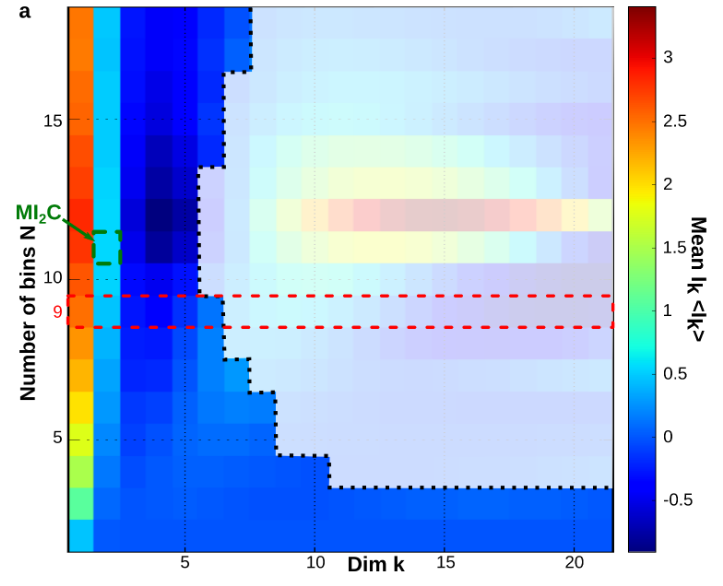

Parameters
==========

Algorithmic parameters
----------------------

dimension_max
~~~~~~~~~~~~~
(integer) maximum Nb  of Random Variable (column or dimension) for the exploration of the cohomology and lattice 

dimension_tot
~~~~~~~~~~~~~ 
(integer) total Nb of Random Variable (column or dimension)  to consider in the input matrix for analysis (the first columns)

sample_size
~~~~~~~~~~~ 
(integer) total Nb of points (rows or number of trials)  to consider in the input matrix for analysis (the first rows)

work_on_transpose
~~~~~~~~~~~~~~~~~
(Boolean) if True take the transpose of the input matrix (this change column into rows etc.)

nb_of_values
~~~~~~~~~~~~
(integer) Number of different values for the sampling of each variable (alphabet size). It is recommanded to tune this parametter in case of continuous variable.
A too small number of values will result in a biased estimation of informations functions that homogenizes information structures, while a too large number of values
with respect to the sample size will lead to a fast curse of dimensionality and an interpretation restricted to low dimensions as depited in the following figure.
The method proposed to tunne nb_of_values is adapted from Maximum Mutual Information Coefficient (MIC, `Reshef et al. 2011 <https://dspace.mit.edu/handle/1721.1/84636>`_ ) 
and is describded in section 6.6 `PDF <https://www.mdpi.com/1099-4300/21/9/869>`_ . It consist in evaluating the mean mutual information path for a set of different 
values of nb_of_values together with the undersampling dimension :math:`k_u` and to choose the one that give the maximum value of mean :math:`I_2`, as depicted bellow, 
or a compromise between this maximum value and a not to low :math:`k_u`. An automatic tuning preocedure could be written (to be done). 
  

sampling_mode
~~~~~~~~~~~~~
(integer: 1,2,3) 

_ sampling_mode = 1: normalization taking the max and min of each columns (normaization row by columns)

_ sampling_mode = 2: normalization taking the max and min of the whole matrix
    

deformed_probability_mode
~~~~~~~~~~~~~~~~~~~~~~~~~
(Boolean) The method associated to true do not work yet (to be done)

_ deformed_probability_mode = True : it will compute the "escort distribution" also called the "deformed probabilities".
*p(n,k)= p(k)^n/ (sum(i)p(i)^n   , where n is the sample size.

[1] Umarov, S., Tsallis C. and Steinberg S., On a q-Central Limit Theorem Consistent with Nonextensive Statistical Mechanics, Milan j. math. 76 (2008), 307–328

[2] Bercher,  Escort entropies and divergences and related canonical distribution. Physics Letters A Volume 375, Issue 33, 1 August 2011, Pages 2969-2973

[3] A. Chhabra, R. V. Jensen, Direct determination of the f(α) singularity spectrum.  Phys. Rev. Lett. 62 (1989) 1327.

[4] C. Beck, F. Schloegl, Thermodynamics of Chaotic Systems, Cambridge University Press, 1993.

[5] Zhang, Z., Generalized Mutual Information.  July 11, 2019

_ deformed_probability_mode = False : it will compute the classical probability, e.g. the ratio of empirical frequencies over total number of observation

[6] Kolmogorov 1933 foundations of probability                     

supervised_mode
~~~~~~~~~~~~~~~
(Boolean) if True it will consider the label vector for supervised learning; if False unsupervised mode

forward_computation_mode
~~~~~~~~~~~~~~~~~~~~~~~~
(Boolean) 

_ forward_computation_mode = True : it will compute joint entropies on the simplicial lattice from low dimension 
to high dimension (co-homological way). For each element of the lattice of random-variable the corresponding joint 
probability is estimated. This allows to explore only the first low dimensions-rank of the lattice, up to dimension_max (in dimension_tot)

_ forward_computation_mode = False : it will compute joint entropies on whole  simplicial lattice from high dimension 
to the marginals (homological way). The joint probability corresponding to all variable is first estimated and then projected on 
lower dimensions using conditional rule. This explore the whole lattice, and imposes dimension_max = dimension_tot   

p_value_undersampling
~~~~~~~~~~~~~~~~~~~~~
(real in ]0,1[) value of the probability that a box have a single point (e.g. undersampled minimum atomic probability = 
1/number of points) over all boxes at a given dimension. It provides a confidence to estimate the undersampling dimenesion Ku above which 
information etimations shall not be considered.  

compute_shuffle
~~~~~~~~~~~~~~~
(Boolean)

_ compute_shuffle = True : it will compute the statictical test of significance of the dependencies (pethel et hah 2014) 
and make shuffles that preserve the marginal but the destroys the mutual informations 

_  compute_shuffle = False : no shuffles and test of the mutual information estimations is acheived

p_value
~~~~~~~
(real in ]0,1[) p value of the test of significance of the dependencies estimated by mutual info 
the H0 hypotheis is the mutual Info distribution does not differ from the distribution of MI with shuffled higher order dependencies

nb_of_shuffle
~~~~~~~~~~~~~
(integer) number of shuffles computed   

Display parameters
------------------

nb_bins_histo 
~~~~~~~~~~~~~
(integer) number of values used for entropy and mutual information distribution histograms and landscapes.      

dim_to_rank 
~~~~~~~~~~~      
(integer) chosen dimension k to rank the k-tuples as a function information functions values.        

number_of_max_val 
~~~~~~~~~~~~~~~~~ 
(integer) number of the first k-tuples with maximum or minimum value to retrieve in a dictionary and to plot the corresponding data 
 points k-subspace.           