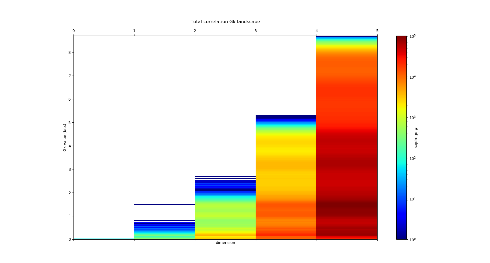
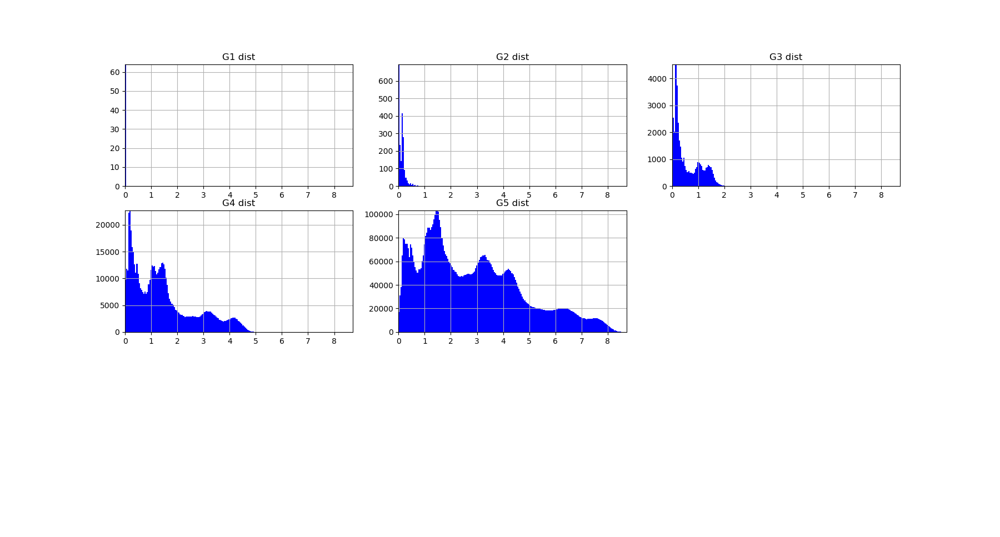
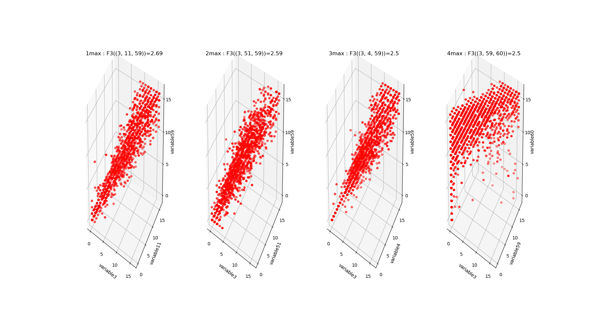
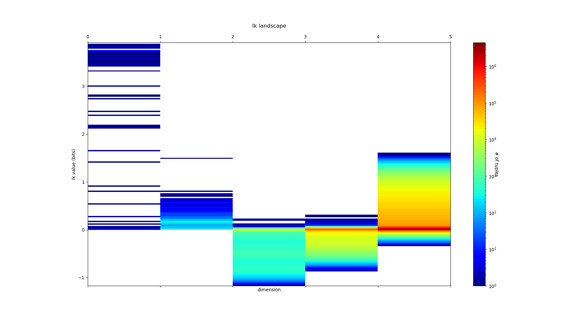
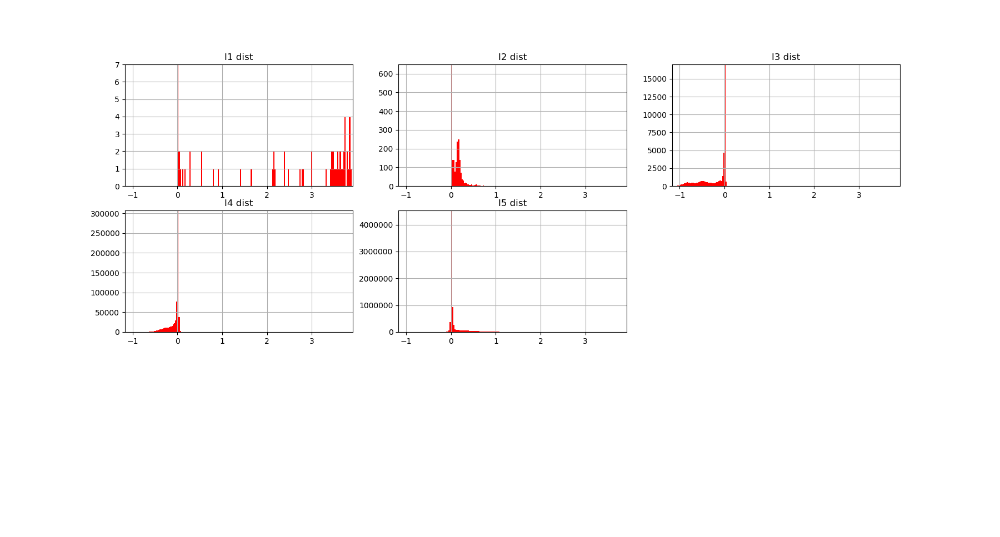
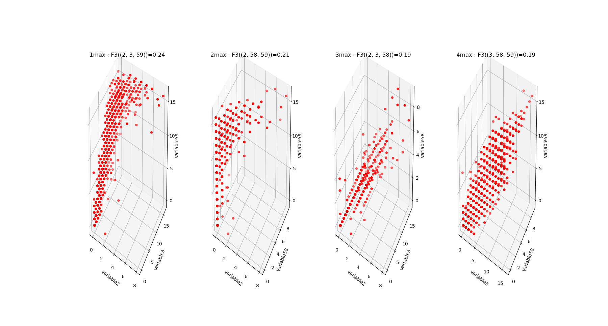

Topological Learning
====================

Topological Learning principles
-------------------------------

Information Complexes
~~~~~~~~~~~~~~~~~~~~~

The presentation of the basic methods and principles we made so far mostly relied on basic information lattice decomposition and simplex structure.
In what follows, we will go one stepp further by introducing to simplicial complexes of information which can display much richer structures. This will be the 
occasion to study more in depth information paths, the analog of homotopical paths in information theory. We will consider subcomplex of this simplicial structure,
invocating the fact that any simplicial complex can be realized as a subcomplex of a simplex (`Steenrod 1947 <https://www.jstor.org/stable/1969172>`_ , p.296).

As introduced previously, an information path :math:`IP_k` of degree k on :math:`I_k` landscape is defined as a sequence of elements of
the lattice that begins at the least element of the lattice (the identity-constant “0”), travels along edges from element to element of 
increasing degree of the lattice and ends at the greatest element of the lattice of degree k (a piecewise linear function). The
first derivative of an :math:`IP_k` path is minus the conditional mutual information. The critical dimension of an :math:`IP_k` path 
is the degree of its first minimum. A positive information path is an information path from 0 to a given :math:`I_k` corresponding to a given 
k-tuple of variables such that :math:`I_k < I_{k-1}  < ... < I_1` (a chain, total order). 
A maximal positive information path is a positive information path of maximal length: it ends at minima of :math:`I_k` along the path (a minima 
of the free energy components quantified by :math:`I_k`. In statistical terms, this minima is equivalent to a conditionnal independence: it means 
that the conditional mutual information (slope) of the paths goes throug 0.  
Those maximal paths identifies the maximal faces of the :math:`I_k` complex and charaterize it, because a simplicial complex is uniquely determined 
by the list of its maximal faces (intoduction to `simplicial homology <https://www.google.com/url?sa=t&rct=j&q=&esrc=s&source=web&cd=&cad=rja&uact=8&ved=2ahUKEwiRyeqK6PrrAhUDyxoKHSBBAcoQFjACegQIBRAB&url=https%3A%2F%2Flink.springer.com%2Farticle%2F10.1007%2Fs00454-017-9865-z%3Fshared-article-renderer&usg=AOvVaw2tpdusnNrLy9q4cqxB240g>`_ ). Hence, the set of all these paths defines uniquely the :math:`I_k` complex (or minimum free energy complex). 
An example of such a complex of dimension 4, with its information path :math:`IP_k`, is given in this figure: 

.. image:: images/info_complex.png

Note that, as a result of classical Shannonian information inequalities, any complex of dimension 3 or below is necessarilly a simplex, indicating 
that in information and statitics, 3 and 4 dimensional topology are also very special. 

Poincaré-Shannon Machine
~~~~~~~~~~~~~~~~~~~~~~~~

Information theory motivated the early stages of Machine Learning and Information sensory processing theories. The principle was self-resumed by Chaitin:
"Understanding is compressing". Notably,  `Attneave (1954) <https://www.semanticscholar.org/paper/Some-informational-aspects-of-visual-perception.-Attneave/6d0198460198fdb49b89d1646049712b3a0683df>`_ 
ennouciated the principles of efficient coding (with Barlow) in the following terms: the goal of sensory perception is to extract the redundancies and to find the 
most compressed representation of the environment. Any kind of symmetry and invariance are information redundancies and Gestalt principles of perception
can be defined on information theoretic terms. This is basically illustrated by, Attneave's famous cat and the topologically sounding Gestalt principle of
perceptual binding illustrated bellow:

.. image::  images/figure_Attneave-Gestalt_complete.png

Since then Information theory has provided machine learning's central functions: the loss functions: Maximum entropy is at the root of Jaynes and may statistical physic inference
model, maximum mutual information (infomax) was stated and studied  by Linsker, Nadal and Parga, and Bell and Sejnowsky and formalized ICA principles and Hebbian 
plasticity, generalizing PCA to non-linear cases, Boltzmann Machine minimized the KL-divergence... untill current Deep Convolutional Neural Networks (CNN) that 
basically minimize cross entropy or "deformed" functions of it like the focal loss (very close indeed to a "deformed probability"!). The principles stayed the same, 
but Neural network architectures, data availability, computational power and software facilities increased enormously.  

.. image::  images/loss_function.jpg

For instance, Boltzmann Machines are reccurent neural networks of binary random variables with hidden layer, that can be formalized as a Markov random field. 
Markov random fields are a small, positive, subcase of information structures (see `proposition 7 (Hu) PDF <https://www.mdpi.com/1099-4300/21/9/869>`_). 

The models developped here are called the Poincaré-Shannon machine in reverence to `Boltzmann Machine <https://www.google.com/url?sa=t&rct=j&q=&esrc=s&source=web&cd=&cad=rja&uact=8&ved=2ahUKEwinjPbMnvjrAhUKzYUKHStSA7gQgAMoAHoECAgQAg&url=http%3A%2F%2Fscholar.google.fr%2Fscholar_url%3Furl%3Dhttps%3A%2F%2Fwww.cs.utoronto.ca%2F~hinton%2Fabsps%2Fcogscibm.pdf%26hl%3Dfr%26sa%3DX%26ei%3Duo5nX8mHM72Ay9YP1OOAiAM%26scisig%3DAAGBfm0MtFqrPZRIBb9G16LNS5kfPdVoFw%26nossl%3D1%26oi%3Dscholarr&usg=AOvVaw29iesHzi-bIRQnf2tYDIH1>`_ , 
`Helmholtz Machine <https://www.google.com/url?sa=t&rct=j&q=&esrc=s&source=web&cd=&cad=rja&uact=8&ved=2ahUKEwjZ8J7GoPjrAhWhxYUKHZxbB74QFjABegQIBBAB&url=http%3A%2F%2Fwww.gatsby.ucl.ac.uk%2F~dayan%2Fpapers%2Fhm95.pdf&usg=AOvVaw1wOfAfLAIVYS83_2EO-6Fi>`_
and the original `Hopfield's network <https://www.pnas.org/content/79/8/2554>`_ , since it implements simplicial homology (see `Poincaré’s Analysis Situs <http://analysis-situs.math.cnrs.fr/-Textes-originaux-.html>`_ , that arguably foundate algebraic topology) 
and information theory in a single framework (see `Shannon’s theory of communication <https://www.google.com/url?sa=t&rct=j&q=&esrc=s&source=web&cd=&cad=rja&uact=8&ved=2ahUKEwjtrqOXrsPrAhVCrxoKHcBDBrQQgAMoAHoECBIQAg&url=http%3A%2F%2Fscholar.google.fr%2Fscholar_url%3Furl%3Dhttps%3A%2F%2Fpure.mpg.de%2Frest%2Fitems%2Fitem_2383162_7%2Fcomponent%2Ffile_2456978%2Fcontent%26hl%3Dfr%26sa%3DX%26scisig%3DAAGBfm2dgGR4Ly92eRCfhrM1BgCnbIBvBA%26nossl%3D1%26oi%3Dscholarr&usg=AOvVaw0ha99XPEPwgTiv3oMC7PTE>`_ , 
that foundate information theory), applied effectively to empirical data.

The Poincaré-Shannon machine are generic feed forward Deep Neural Networks (DNN) model with a layered structure given by a chain complex (of random variables), e.g. imposed by algebraic topology,
and whose connections are given by the edges of the embedding lattice. 
In the basic simplicial case developped computationnaly here, the rank of the layers of the DNN is the dimension of the faces of the complex, and the highest rank of the layers is the
dimension of the complex. As with usual DNN, the dimension of the analized patterns increases with the depth of the layers (see for illustration, `figure 2 Zeiler and Fergus 2013 <https://arxiv.org/abs/1311.2901>`_)
The neurons are random variables, and are whatever measurable functions (linear, non linear), hence covering a "fairly" large class of functions (notably, using the  `Solovay's axiomatic of set theory <https://www.researchgate.net/publication/239065757_A_Model_of_Set_Theory_in_Which_Every_Set_of_Reals_is_Lebesgue_Measurable>`_, all functions 
are measurable). In the general (and computationally hard) setting of general information strutures, that considers the lattice of partitions (cf. section "how infotopo works"), the Poincaré-Shannon machine are 
Universal Classifiers, in the sens that a partition corresponds exactly to an equivalence class and in theory such a model would span all classifications up to equivalence). 
This topological structure allows, and de facto implements the fact, that neural layers are not necessarilly serial as in current DNN, but can be parralel. 
Such  architectures are well known in real sensory cortical systems, for example the ventral and dorsal visual streams in human cortex would corresponds 
to two facets of the human brain complex with two (at least partially disjoint information paths) and analyze conditionally independent features of the input such as the “where and what” 
(dorso and ventral, respectively `PDF <https://www.mdpi.com/1099-4300/21/9/881>`_).
Hence one of the interest of such deep model is that its architecture (number of layers, number of neurons at each layer, connectivity) and computation is fully mastered and understood, as far as
simplicial complexes can be: it can be understood as an algebrization of neural networks (there are other very interesting approachs of such topic (not probabilistic as here), 
see for example the `neural rings (Curto and Youngs 2013-2020) <https://arxiv.org/pdf/1511.00255.pdf>`_ or `Morisson et al. 2016 <https://arxiv.org/abs/1605.04463>`_ `Morisson and Curto 2018 <https://arxiv.org/pdf/1804.01487.pdf>`_ ).  

Beside this architectural difference with usual DNN, the second important difference is that the learning rule is a "forward propagation", imposed by the cohomological
"direction", whereas usual DNN implements a backpropagation learning rule (homological "direction") which implements basically the chain rule of derivation (`Kelley 1960 <https://www.google.com/url?sa=t&rct=j&q=&esrc=s&source=web&cd=&ved=2ahUKEwiVgubR3PjrAhWGDxQKHU7XAOMQFjABegQIBRAB&url=https%3A%2F%2Fwww.gwern.net%2Fdocs%2Fstatistics%2Fdecision%2F1960-kelley.pdf&usg=AOvVaw3kqby-zRKHaI0gxZPh8Dax>`_ , 
`Le Cun 1985 <https://www.google.com/url?sa=t&rct=j&q=&esrc=s&source=web&cd=&ved=2ahUKEwjo4POW4PjrAhWrAGMBHbFRBY8QFjAAegQIBBAB&url=http%3A%2F%2Fyann.lecun.com%2Fexdb%2Fpublis%2Fpdf%2Flecun-85.pdf&usg=AOvVaw0IUPPzZ_XUtTjFjzpgm7gG>`_,
`Dreyfus 1962 <https://www.google.com/url?sa=t&rct=j&q=&esrc=s&source=web&cd=&ved=2ahUKEwjI8JmG3fjrAhXq6eAKHfP6CeoQFjACegQIAxAB&url=https%3A%2F%2Fcore.ac.uk%2Fdownload%2Fpdf%2F82751002.pdf&usg=AOvVaw2uSnnLkJUmd9ofdIxpjN9E>`_, 
`Rumelhart et al. 1986 <https://www.google.com/url?sa=t&rct=j&q=&esrc=s&source=web&cd=&ved=2ahUKEwjswqz33fjrAhVGKBoKHXrBC9sQFjACegQIAxAB&url=https%3A%2F%2Fwww.iro.umontreal.ca%2F~vincentp%2Fift3395%2Flectures%2Fbackprop_old.pdf&usg=AOvVaw0EfTJmB5LLenmX5JrYjp-O>`_).
The information topology take profit of the coboundary nature of :math:`I_k` functions, a (discrete in the present particular case) statistical analog of differential operator. 
This means that there is no descent as in the usual DNN implementation, but that computation of those :math:`I_k` and conditional :math:`I_k` implements the descent.
Notably, the introduction of the multiplicity decomposition of “energy functions” formalizes learning in neural networks in terms of a combinatorial 
family of analytically independent functions :math:`I_k` (moreover with independent gradients) on the probability simplex (`Han 1975 <https://www.google.com/url?sa=t&rct=j&q=&esrc=s&source=web&cd=&cad=rja&uact=8&ved=2ahUKEwiG2ODn5fjrAhVDx4UKHfSNATUQgAMoAHoECAgQAg&url=http%3A%2F%2Fscholar.google.fr%2Fscholar_url%3Furl%3Dhttps%3A%2F%2Fwww.sciencedirect.com%2Fscience%2Farticle%2Fpii%2FS0019995875800040%2Fpdf%253Fmd5%253D86adf67be6e855ec022029450d43b0ce%2526pid%253D1-s2.0-S0019995875800040-main.pdf%26hl%3Dfr%26sa%3DX%26ei%3DZdlnX8qEO7OTy9YP9bWDyAc%26scisig%3DAAGBfm0fipxDddOGu6177-TJWIh6DFJuWg%26nossl%3D1%26oi%3Dscholarr&usg=AOvVaw3bBFjSpCiBOnsAeG3lIzOX>`_ 
`Han 1978 <https://www.google.com/url?sa=t&rct=j&q=&esrc=s&source=web&cd=&cad=rja&uact=8&ved=2ahUKEwiUwdj75fjrAhUG9IUKHfuqAkAQFjACegQIBxAB&url=https%3A%2F%2Fwww.sciencedirect.com%2Fscience%2Farticle%2Fpii%2FS0019995878902759%2Fpdf%3Fmd5%3D18d2eec90c7b3dd3009f70a8bb39eb80%26pid%3D1-s2.0-S0019995878902759-main.pdf%26_valck%3D1&usg=AOvVaw1HIUfffUm-y61YrosK2XBv>`_ Theorem 4 in `PDF <https://www.mdpi.com/1099-4300/21/9/869>`_): instead of a single energy and 
associated gradient descent, mutual information provides a multiplicity of gradients.
The following illustration presents the DNN architecture associated with the previous example of an :math:`I_4` complex:

.. image::  images/figure_deep_neural_net.png

Unsupervised topological learning
---------------------------------

Causality challenge dataset
~~~~~~~~~~~~~~~~~~~~~~~~~~~

We will illustrate the computation of free energy complex (or :math:`I_k` complex) on the synthetic dataset `LUCAS  (LUng CAncer Simple set) <http://www.causality.inf.ethz.ch/data/LUCAS.html>`_ 
of the  `causality challenge <http://www.causality.inf.ethz.ch/challenge.php>`_. Before trying the code on your computer, you will have to download the file "lucas0_train.csv" 
and to save it on your hard disk (here at the path "/home/pierre/Documents/Data/lucas0_train.csv"), and to put your own path in the following commands with the initialisation
of infotopo's parameters. 

.. code:: python3

        import pandas as pd
        dataset = pd.read_csv(r"/home/pierre/Documents/Data/lucas0_train.csv")  # csv to download at http://www.causality.inf.ethz.ch/data/LUCAS.html
        dataset_df = pd.DataFrame(dataset, columns = dataset.columns)
        dataset = dataset.to_numpy()
        information_topo = infotopo(dimension_max = dataset.shape[1], 
                                dimension_tot = dataset.shape[1], 
                                sample_size = dataset.shape[0], 
                                work_on_transpose = False,
                                nb_of_values = 2, 
                                sampling_mode = 1, 
                                deformed_probability_mode = False,
                                supervised_mode = False, 
                                forward_computation_mode = False,
                                dim_to_rank = 3, number_of_max_val = 4)

The dataset is composed of 11 variables: 1: Smoking, 2: Yellow_Fingers, 3: Anxiety, 4: Peer_Pressure, 5: Genetics, 6: Attention_Disorder, 7: Born_an_Even_Day,
8: Car_Accident, 9: Fatigue, 10: Allergy, 11: Coughing and the 12th variable of iterest: Lung cancer. 
The (buildin) causality chain relations among those varaibles follow this schema:

.. image:: images/causality_schema_LUCAS0.png

Information Complexes
~~~~~~~~~~~~~~~~~~~~~

To compute (approximation) of the information complex (free-energy complex), you can use the following command:

.. code:: python3

    Ninfomut, Nentropie = information_topo.fit(dataset)
    information_topo.information_complex(Ninfomut)

The method "fit" is just a wrapper of the methods "simplicial_entropies_decomposition" and "simplicial_infomut_decomposition", that is introduced to correspond to
the usual methods of scikit-learn, keras, tensorflow (...). The set of all paths of degree-dimension k is intractable computationally (complexity in :math:`\mathcal{O}(k!)` ). 
In order to bypass this issue, the current method "information_complex" computes a fast local algorithm that selects at each element of degree k of a path, the 
positive information path with maximal or minimal :math:`I_{k+1}` value (equivalently, extremal conditional mutual informations) or stops whenever  
:math:`X_k.I_{k+1} \leq 0` and ranks those paths by their length. The justification of this elementary heuristic is that it should capture the paths with the most interesting 
tuples, e.g the one highest anf lowest :math:`I_{k}`. No doubt that this approximation is rought and shall be improved in future (to be done). 
The result on the causality challenge dataset is:

.. image:: images/causality_info_paths.png

and it prints the following paths:

.. parsed-literal::

    The path of maximal mutual-info Nb 1  is : [5, 12, 11, 9, 8, 6, 2, 1, 10, 4], The path of minimal mutual-info Nb 1  is : [7, 2, 11], The path of maximal mutual-info Nb 2  is :[2, 12, 11, 9, 3, 6, 10, 5], The path of minimal mutual-info Nb 2  is : [3, 4, 1], The path of maximal mutual-info Nb 3  is : [1, 2, 12, 11, 9, 3, 6, 10, 5], The path of minimal mutual-info Nb 3  is : [10, 4, 7], The path of maximal mutual-info Nb 4  is : [9, 11, 12, 1, 2, 3, 6, 10, 5], The path of minimal mutual-info Nb 4  is : [4, 3, 1], The path of maximal mutual-info Nb 5  is :[8, 9, 11, 12, 5, 6, 2, 1, 10, 4], The path of minimal mutual-info Nb 5  is : [6, 1, 12] etc..

The first maximal path [5, 12, 11, 9, 8, 6, 2, 1, 10, 4]  as length 10 and the first 5 variables corresponds to one of the longest causal chain of the data as illustrated bellow. 
The fact that the resulting path is so long is likely due to the generating algorithm used for Lucas, and the last [6,2,1,10,4] errors could be removed by statistical test 
thresholding on conditional mutual information values. The next maximal paths fail to identify the other long causal chain of the data, probably as a consequence of
the rought approximation used by the algorithm. The First two minimal paths [7, 2, 11] and [3, 4, 1] identifies unrelated variables or multiple cause causality scheme.

.. image:: images/causality_info_paths_results.png

Beware, that the computational heuristic provided does not give a chain complex in the algebraic topology sens, but just a partial approximate 
view: notably due to the heuristic some chains identified by the algorithm may included in other (and hence may bot be maximal faces).
The "good" algorithm, is easy to write: 1. compute all the strictly :math:`I_{k}` decreasing chains 2. rank them by length 3. start from the shortests: if it is included in the longest then remove if not 
then if  its included in the second longest then removen and so on. However, it can only be runned on very low dimensional spaces (done but currently removed from the package). 

Digits Dataset
~~~~~~~~~~~~~~

In order to illustrate unsupervised and supervised learning methods we will now turn to the classical dataset of Digits NIST, which is a common toy dataset to train and test
machine learning models. We load it as previously using the symapthic Scikit-learn repository:

.. code:: python3

    dataset = load_digits()
    print(dataset.DESCR)
    fig, ax_array = plt.subplots(20, 20)
    axes = ax_array.flatten()
    for i, ax in enumerate(axes):
        ax.imshow(dataset.images[i], cmap='gray_r')
    plt.setp(axes, xticks=[], yticks=[], frame_on=False)
    plt.tight_layout(h_pad=0.5, w_pad=0.01)
    dataset_df = pd.DataFrame(dataset.data, columns = dataset.feature_names)
    dataset_df = pd.DataFrame(dataset.data, columns=dataset.feature_names)
    dataset = dataset.data 

It prints the following complete description of the dataset: 

.. parsed-literal::

    Optical recognition of handwritten digits dataset
    --------------------------------------------------

    **Data Set Characteristics:**

    :Number of Instances: 5620
    :Number of Attributes: 64
    :Attribute Information: 8x8 image of integer pixels in the range 0..16.
    :Missing Attribute Values: None
    :Creator: E. Alpaydin (alpaydin '@' boun.edu.tr)
    :Date: July; 1998

    This is a copy of the test set of the UCI ML hand-written digits datasets  https://archive.ics.uci.edu/ml/datasets/Optical+Recognition+of+Handwritten+Digits

    The data set contains images of hand-written digits: 10 classes where each class refers to a digit.

    Preprocessing programs made available by NIST were used to extract normalized bitmaps of handwritten digits from a preprinted form. From a
    total of 43 people, 30 contributed to the training set and different 13 to the test set. 32x32 bitmaps are divided into nonoverlapping blocks of
    4x4 and the number of on pixels are counted in each block. This generates an input matrix of 8x8 where each element is an integer in the range
    0..16. This reduces dimensionality and gives invariance to small distortions.

    For info on NIST preprocessing routines, see M. D. Garris, J. L. Blue, G., T. Candela, D. L. Dimmick, J. Geist, P. J. Grother, S. A. Janet, and C.
    L. Wilson, NIST Form-Based Handprint Recognition System, NISTIR 5469, 1994.

    .. topic:: References

      - C. Kaynak (1995) Methods of Combining Multiple Classifiers and Their Applications to Handwritten Digit Recognition, MSc Thesis, Institute of
        Graduate Studies in Science and Engineering, Bogazici University.
      - E. Alpaydin, C. Kaynak (1998) Cascading Classifiers, Kybernetika.
      - Ken Tang and Ponnuthurai N. Suganthan and Xi Yao and A. Kai Qin. Linear dimensionalityreduction using relevance weighted LDA. School of
        Electrical and Electronic Engineering Nanyang Technological University. 2005.
      - Claudio Gentile. A New Approximate Maximal Margin Classification Algorithm. NIPS. 2000.

And illustrates the dataset with the following sample of digits pictures:

.. image:: images/digits_dataset_sample.png

Adaptive computational complexity
~~~~~~~~~~~~~~~~~~~~~~~~~~~~~~~~~

The images of digits dataset are 8*8 pixels, meaning that we have 64 Random Variables or dimensions: this will introduce us to the problemantic of high dimensional space 
(here not so high) and of computational complexity. In this case the information simplicial structure has :math:`2^{64}` information estimations to compute, which is much 
too big, and we propose a partial exploration that will stop the computation at a given dimension  "dimension_max".
This methods of partial exploration allows to adapt the computational (time) complexity of the algorithm to a reasonable complexity given your computational ressources and the dimension of the dataset.
As we have seen, when increasing the dimension of the dataset, the raw computation potentially grows as :math:`\mathcal{O}(2^n)`. In order to master and circumvince this
problem, a partial exploration of information structures as been written, allowing to explore only all the k first dimensions with :math:`n \geq k`. This is acheived by 
setting the parametter "dimension_max" to k and "forward_computation_mode" to "True". For example, setting "dimension_max=2" will restrict the computation to the :math:`\binom{n}{1} = n` and
the :math:`\binom{n}{2} = n!/(2!(n-2)!) = n.(n-1)/2` estimations of information, which is the (symetric) usual complexity  :math:`\mathcal{O}(n^2)` of metric or graph 
based machine learning algorithm. 
Setting to 3, there will be :math:`\binom{n}{1} + \binom{n}{2} + \binom{n}{3}` estimations of information giving a complexity in :math:`\mathcal{O}(n^3)` etc...  Of course, we gain what we loose, and the deployement of infotopo on GPU should give a bit more
of ressources  (currently failed). 
In 64 dimensions, choosing an exploration of the 5 first dimensions (64+2016+41664+635376+7624512=8303632 estimations) gives a reasonably long computation of several hours on a personal laptop (has acheived here)    
To set such exploration, we initialize infotopo using the commands:

.. code:: python3

    information_topo = infotopo(dimension_max = 5, 
                                dimension_tot = dataset.shape[1], 
                                sample_size = dataset.shape[0], 
                                work_on_transpose = False,
                                nb_of_values = 17, 
                                sampling_mode = 1, 
                                deformed_probability_mode = False,
                                supervised_mode = False, 
                                forward_computation_mode = True,
                                dim_to_rank = 3, number_of_max_val = 4)   
   

For data scientist used to deep learning terminology, this intialization corresponds to building the model, although extremely simple. 
As you see, the whole structure of the model is fully constrained by the dataset's embedding dimension, the dimension max (computational complexity restriction), and the number of values chosen for the variables (with other purely 
computational internal parameter).

Natural image statistics
~~~~~~~~~~~~~~~~~~~~~~~~

We now apply the model to digits dataset in a first unsupervised case that considers the pixels as variables-dimension up the fifth dimension.
It means that we will consider all statistical dependencies, or statistically dependent patterns composed of up to 5 pixels in the digits datset.
In computational vision and neursocience, such a task pertains to the domain of natural image statistics studies 
(see notably chap. 1.4 of the book "natural image statistics", `Hyvärinen et al 2009 <https://www.google.com/url?sa=t&rct=j&q=&esrc=s&source=web&cd=&cad=rja&uact=8&ved=2ahUKEwjQxtKdpJTsAhUS4OAKHVEHD1oQgAMoAHoECBMQAg&url=http%3A%2F%2Fscholar.google.fr%2Fscholar_url%3Furl%3Dhttps%3A%2F%2Fwww.academia.edu%2Fdownload%2F640016%2Fgt1uh8u6fhk4474.pdf%26hl%3Dfr%26sa%3DX%26ei%3DukJ2X9avNJOdmwH7hLb4Cg%26scisig%3DAAGBfm30s5iDfC0ttHl3G9rMmdSnQx-TAA%26nossl%3D1%26oi%3Dscholarr&usg=AOvVaw2ePjSwQea67qYJwT9aeOd8>`_ ).
Of course, the example will present here only a very small subset of natural image statistics corresponding to human hand written digits, but the principle
of the study stays the same for other kind of images. We fit the model and display the informations landscape by running the following code:  

.. code:: python3

    Ninfomut, Nentropie =  information_topo.fit(dataset)
    Ntotal_correlation = information_topo.total_correlation_simplicial_lanscape(Nentropie)
    dico_max, dico_min = information_topo.display_higher_lower_information(Ntotal_correlation, dataset)
    information_topo.mutual_info_simplicial_lanscape(Ninfomut)
    dico_max, dico_min = information_topo.display_higher_lower_information(Ninfomut, dataset)

The free energy or total correlation  :math:`G_k` landscape, and its 4 maxima triplets data subspace we obtain are the following:

The mutual information :math:`I_k` landscape, and its 4 maxima triplets data subspace we obtain are the following:

Both landscapes shows the presence of important higher order statitical patterns, with clear and complex multimodal distributions. 
For those who where not convinced yet that higher orders statictics matters, it now shall be the case: they are
indeed the support of our (higher level) every day world's perception and object recognition.
:math:`I_k` landscape notably shows that most k-uplets of pixels are k-independent (e.g. :math:`I_k=0`). The computation of information 
distances and volume, joint entropies, conditional informations (...) are left as an exercise, but all of them present some meaningfull 
distributions-spectra.   

Convolutional methods
~~~~~~~~~~~~~~~~~~~~~

The preceding computation of statistical structures in images has the default of not being translation invariant, made obvious here by the centering 
preprocessing of the digits in the images. Such a potential problem is easily overcome by using basic convolutional patches instead of the direcy
images, just as Convolutional layer of Neural Network do. Note that implementing an information network corresponding to current Convolutional Network
would require an iterative process of pooling the maximal information modules and of landscape info paths computation (to be done both theoretically 
and in practice). However, such a method appears more for the moment as a computational trick to reduce computation rather than a firmly theoretically established method.
To extract convolutional patchs of the images we use the function "convolutional_patchs". The function extracts images patchs of m*m pixels 
(with :math:`m = \lfloor \sqrt{dimension_max} \rfloor` ) by sliding on the images. As the function change the matrix of data input and its shape,
the function reset automatically dimension_tot=dimansion_max to :math:`(\lfloor \sqrt{dimension_max} \rfloor)^2` and the sample_size to 
:math:`sample_size.(n-(m-1))^2` (where image are n*n pixels and patchs are m*m pixels, and there are :math:`(n-(m-1))^2` convolutional patchs in a single image).
In the example below we set dimansion_max to 16 and hence patchs of 4*4 pixels in sample_size=100 digits images, and we obtain 2500 points-patchs in 16 dimensions.

.. code:: python3
    information_topo = infotopo(dimension_max = 16, 
                                dimension_tot = 16, 
                                sample_size = 100, 
                                work_on_transpose = False,
                                nb_of_values = 17, 
                                sampling_mode = 1, 
                                deformed_probability_mode = False,
                                supervised_mode = False, 
                                forward_computation_mode = False)
    dataset = information_topo.convolutional_patchs(dataset)  
    Ninfomut, Nentropie =  information_topo.fit(dataset)
    Ntotal_correlation = information_topo.total_correlation_simplicial_lanscape(Nentropie)
    dico_max, dico_min = information_topo.display_higher_lower_information(Ntotal_correlation, dataset)
    information_topo.mutual_info_simplicial_lanscape(Ninfomut)
    dico_max, dico_min = information_topo.display_higher_lower_information(Ninfomut, dataset)                          

Supervised topological learning
---------------------------------