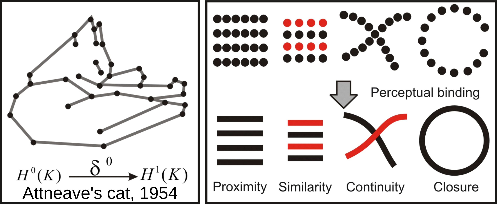
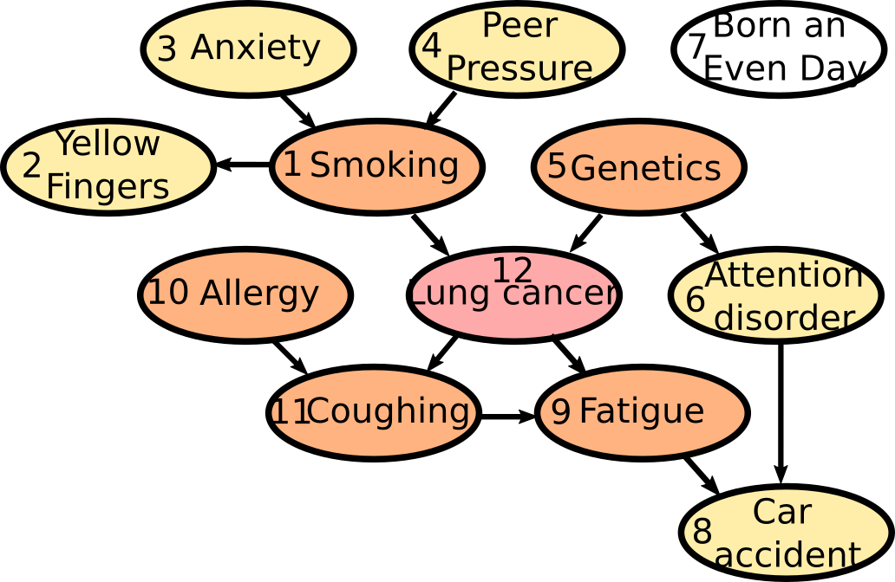

Topological Learning
====================

Topological Learning principles
-------------------------------

Information Complexes
~~~~~~~~~~~~~~~~~~~~~

The presentation of the basic methods and principles we made so far mostly relied on basic information lattice decomposition and simplex structure.
In what follows, we will go one stepp further by introducing to simplicial complexes of information which can display much richer structures. This will be the 
occasion to study more in depth information paths, the analog of homotopical paths in information theory. We will consider subcomplex of this simplicial structure,
invocating the fact that any simplicial complex can be realized as a subcomplex of a simplex (`Steenrod 1947 <https://www.jstor.org/stable/1969172>`_ , p.296).

As introduced previously, an information path :math:`IP_k` of degree k on :math:`I_k` landscape is defined as a sequence of elements of
the lattice that begins at the least element of the lattice (the identity-constant “0”), travels along edges from element to element of 
increasing degree of the lattice and ends at the greatest element of the lattice of degree k (a piecewise linear function). The
first derivative of an :math:`IP_k` path is minus the conditional mutual information. The critical dimension of an :math:`IP_k` path 
is the degree of its first minimum. A positive information path is an information path from 0 to a given :math:`I_k` corresponding to a given 
k-tuple of variables such that :math:`I_k < I_{k-1}  < ... < I_1` (a chain, total order). 
A maximal positive information path is a positive information path of maximal length: it ends at minima of :math:`I_k` along the path (a minima 
of the free energy components quantified by :math:`I_k`. In statistical terms, this minima is equivalent to a conditionnal independence: it means 
that the conditional mutual information (slope) of the paths goes throug 0.  
Those maximal paths identifies the maximal faces of the :math:`I_k` complex and charaterize it, because a simplicial complex is uniquely determined 
by the list of its maximal faces. Hence, the set of all these paths defines uniquely the :math:`I_k` complex (or minimum free energy complex). 
An example of such a complex of dimension 4, with its information path :math:`IP_k`, is given in this figure: 

.. image:: images/info_complex.png

Note that, as a result of classical Shannonian information inequalities, any complex of dimension 3 or below is necessarilly a simplex, indicating 
that in information and statitics, 3 and 4 dimensional topology are also very special. 

Poincaré-Shannon Machine
~~~~~~~~~~~~~~~~~~~~~~~~

Information theory motivated the early stages of Machine Learning and Information sensory processing theories. The principle was self-resumed by Chaitin:
"Understanding is compressing". Notably,  `Attneave (1952) <https://www.semanticscholar.org/paper/Some-informational-aspects-of-visual-perception.-Attneave/6d0198460198fdb49b89d1646049712b3a0683df>`_ 
ennouciated the principles of efficient coding (with Barlow) in the following terms: the goal of sensory perception is to extract the redundancies and to find the 
most compressed representation of the environment. Any kind of symmetry and invariance are information redundancies and Gestalt principles of perception
can be defined on information theoretic terms. This is basically illustrated by, Attneave's famous cat and the topologically sounding Gestalt principle of
perceptual binding illustrated bellow:

Since then Information theory has provided its central functions: the loss functions: Maximum entropy is at the root of Jaynes and may statistical physic inference
model, maximum mutual information (infomax) was stated and studied  by Linsker, Nadal and Parga, and Bell and Sejnowsky and formalized ICA principles and Hebbian 
plasticity, generalizing PCA to non-linear cases, Boltzmann Machine minimized the KL-divergence... untill current Deep Convolutional Neural Networks (CNN) that 
basically minimize cross entropy or "deformed" functions of it like the focal loss (very close indeed to a "deformed probability"!). The principles stayed the same, 
but Neural network architectures, data availability, computational power and software facilities increased enormously.  

.. image::  images/loss_function.jpg

For instance, Boltzmann Machines are reccurent neural networks of binary random variables with hidden layer, that can be formalized as a Markov random field. 
Markov random fields are a small, positive, subcase of information structures (see `proposition 7 (Hu) PDF <https://www.mdpi.com/1099-4300/21/9/869>`_). 

The models developped here are called the Poincaré-Shannon machine in reverence to `Boltzmann Machine <https://www.google.com/url?sa=t&rct=j&q=&esrc=s&source=web&cd=&cad=rja&uact=8&ved=2ahUKEwinjPbMnvjrAhUKzYUKHStSA7gQgAMoAHoECAgQAg&url=http%3A%2F%2Fscholar.google.fr%2Fscholar_url%3Furl%3Dhttps%3A%2F%2Fwww.cs.utoronto.ca%2F~hinton%2Fabsps%2Fcogscibm.pdf%26hl%3Dfr%26sa%3DX%26ei%3Duo5nX8mHM72Ay9YP1OOAiAM%26scisig%3DAAGBfm0MtFqrPZRIBb9G16LNS5kfPdVoFw%26nossl%3D1%26oi%3Dscholarr&usg=AOvVaw29iesHzi-bIRQnf2tYDIH1>`_ , 
`Helmholtz Machine <https://www.google.com/url?sa=t&rct=j&q=&esrc=s&source=web&cd=&cad=rja&uact=8&ved=2ahUKEwjZ8J7GoPjrAhWhxYUKHZxbB74QFjABegQIBBAB&url=http%3A%2F%2Fwww.gatsby.ucl.ac.uk%2F~dayan%2Fpapers%2Fhm95.pdf&usg=AOvVaw1wOfAfLAIVYS83_2EO-6Fi>`_
and the original `Hopfield's network <https://www.pnas.org/content/79/8/2554>`_ , since it implements simplicial homology (see `Poincaré’s Analysis Situs <http://analysis-situs.math.cnrs.fr/-Textes-originaux-.html>`_ , that arguably foundate algebraic topology) 
and information theory in a single framework (see `Shannon’s theory of communication <https://www.google.com/url?sa=t&rct=j&q=&esrc=s&source=web&cd=&cad=rja&uact=8&ved=2ahUKEwjtrqOXrsPrAhVCrxoKHcBDBrQQgAMoAHoECBIQAg&url=http%3A%2F%2Fscholar.google.fr%2Fscholar_url%3Furl%3Dhttps%3A%2F%2Fpure.mpg.de%2Frest%2Fitems%2Fitem_2383162_7%2Fcomponent%2Ffile_2456978%2Fcontent%26hl%3Dfr%26sa%3DX%26scisig%3DAAGBfm2dgGR4Ly92eRCfhrM1BgCnbIBvBA%26nossl%3D1%26oi%3Dscholarr&usg=AOvVaw0ha99XPEPwgTiv3oMC7PTE>`_ , 
that foundate information theory), applied effectively to empirical data.

The Poincaré-Shannon machine are generic feed forward Deep Neural Networks (DNN) model with a layered structure given by a chain complex (of random variables), e.g. imposed by algebraic topology. 
In the basic simplicial case developped computationnaly here, the rank of the layers of the DNN is the dimension of the faces of the complex, and the highest rank of the layers is the
dimension of the complex. 
The neurons are random variables, and are whatever measurable functions (linear, non linear), which is a "fairly" large class of functions (notably, using the  `Solovay's axiomatic of set theory <https://www.researchgate.net/publication/239065757_A_Model_of_Set_Theory_in_Which_Every_Set_of_Reals_is_Lebesgue_Measurable>`_, all functions 
are measurable). In the general (and computationally hard) setting of general information strutures, that considers the lattice of partitions (cf. section "how infotopo works"), the Poincaré-Shannon machine are 
Universal Classifiers, in the sens that a partition corresponds exactly to an equivalence class and in theory such a model would span all classifications up to equivalence). 
This topological structure allows, and de facto implements the fact, that neural layers are not necessarilly serial as in current DNN, but can be parralel. 
Such  architectures are well known in real sensory cortical systems, for example the ventral and dorsal visual streams in human cortex would corresponds 
to two facets of the human brain complex with two (at least partially disjoint information paths) and analyze conditionally independent features of the input such as the “where and what” 
(dorso and ventral, respectively `PDF <https://www.mdpi.com/1099-4300/21/9/881>`_).

Beside this architectural difference with usual DNN, the second important difference is that the learning rule is a "forward propagation", imposed by the cohomological
"direction", whereas usual DNN implements a backpropagation learning rule (homological "direction") which implements basically the chain rule of derivation (`Kelley 1960 <https://www.google.com/url?sa=t&rct=j&q=&esrc=s&source=web&cd=&ved=2ahUKEwiVgubR3PjrAhWGDxQKHU7XAOMQFjABegQIBRAB&url=https%3A%2F%2Fwww.gwern.net%2Fdocs%2Fstatistics%2Fdecision%2F1960-kelley.pdf&usg=AOvVaw3kqby-zRKHaI0gxZPh8Dax>`_ , 
`Le Cun 1985 <https://www.google.com/url?sa=t&rct=j&q=&esrc=s&source=web&cd=&ved=2ahUKEwjo4POW4PjrAhWrAGMBHbFRBY8QFjAAegQIBBAB&url=http%3A%2F%2Fyann.lecun.com%2Fexdb%2Fpublis%2Fpdf%2Flecun-85.pdf&usg=AOvVaw0IUPPzZ_XUtTjFjzpgm7gG>`_,
`Dreyfus 1962 <https://www.google.com/url?sa=t&rct=j&q=&esrc=s&source=web&cd=&ved=2ahUKEwjI8JmG3fjrAhXq6eAKHfP6CeoQFjACegQIAxAB&url=https%3A%2F%2Fcore.ac.uk%2Fdownload%2Fpdf%2F82751002.pdf&usg=AOvVaw2uSnnLkJUmd9ofdIxpjN9E>`_, 
`Rumelhart et al. 1986 <https://www.google.com/url?sa=t&rct=j&q=&esrc=s&source=web&cd=&ved=2ahUKEwjswqz33fjrAhVGKBoKHXrBC9sQFjACegQIAxAB&url=https%3A%2F%2Fwww.iro.umontreal.ca%2F~vincentp%2Fift3395%2Flectures%2Fbackprop_old.pdf&usg=AOvVaw0EfTJmB5LLenmX5JrYjp-O>`_).
 The information topology take profit of the coboundary nature of :math:`I_k` functions, a (discrete in the present particular case) statistical analog of differential operator. 
 This means that there is no descent as in the usual DNN implementation, but that computation of those :math:`I_k` and conditional :math:`I_k` implements the descent.
Notably, the introduction of the multiplicity decomposition of “energy functions” formalizes learning in neural networks in terms of a combinatorial 
family of analytically independent functions :math:`I_k` (moreover with independent gradients) on the probability simplex (`Han 1975 <https://www.google.com/url?sa=t&rct=j&q=&esrc=s&source=web&cd=&cad=rja&uact=8&ved=2ahUKEwiG2ODn5fjrAhVDx4UKHfSNATUQgAMoAHoECAgQAg&url=http%3A%2F%2Fscholar.google.fr%2Fscholar_url%3Furl%3Dhttps%3A%2F%2Fwww.sciencedirect.com%2Fscience%2Farticle%2Fpii%2FS0019995875800040%2Fpdf%253Fmd5%253D86adf67be6e855ec022029450d43b0ce%2526pid%253D1-s2.0-S0019995875800040-main.pdf%26hl%3Dfr%26sa%3DX%26ei%3DZdlnX8qEO7OTy9YP9bWDyAc%26scisig%3DAAGBfm0fipxDddOGu6177-TJWIh6DFJuWg%26nossl%3D1%26oi%3Dscholarr&usg=AOvVaw3bBFjSpCiBOnsAeG3lIzOX>`_ 
`Han 1978 <https://www.google.com/url?sa=t&rct=j&q=&esrc=s&source=web&cd=&cad=rja&uact=8&ved=2ahUKEwiUwdj75fjrAhUG9IUKHfuqAkAQFjACegQIBxAB&url=https%3A%2F%2Fwww.sciencedirect.com%2Fscience%2Farticle%2Fpii%2FS0019995878902759%2Fpdf%3Fmd5%3D18d2eec90c7b3dd3009f70a8bb39eb80%26pid%3D1-s2.0-S0019995878902759-main.pdf%26_valck%3D1&usg=AOvVaw1HIUfffUm-y61YrosK2XBv>`_ Theorem 4 in `PDF <https://www.mdpi.com/1099-4300/21/9/869>`_): instead of a single energy and 
associated gradient descent, mutual information provides a multiplicity of gradients.

Unsupervised topological learning
---------------------------------

Causality challenge dataset
~~~~~~~~~~~~~~~~~~~~~~~~~~~

We will illustrate the computation of free energy complex (or :math:`I_k` complex) on the synthetic dataset `LUCAS  (LUng CAncer Simple set) <http://www.causality.inf.ethz.ch/data/LUCAS.html>`_ 
of the  `causality challenge <http://www.causality.inf.ethz.ch/challenge.php>`_. Before trying the code on your computer, you will have to download the file "lucas0_train.csv" 
and to save it on your hard disk (here at the path "/home/pierre/Documents/Data/lucas0_train.csv"), and to put your own path in the following commands with the initialisation
of infotopo's parameters. 

.. code:: python3

        import pandas as pd
        dataset = pd.read_csv(r"/home/pierre/Documents/Data/lucas0_train.csv")  # csv to download at http://www.causality.inf.ethz.ch/data/LUCAS.html
        dataset_df = pd.DataFrame(dataset, columns = dataset.columns)
        dataset = dataset.to_numpy()
        dimension_max = dataset.shape[1]
        dimension_tot = dataset.shape[1]
        sample_size = dataset.shape[0]
        nb_of_values = 2
        forward_computation_mode = False
        work_on_transpose = False
        supervised_mode = False
        sampling_mode = 1
        deformed_probability_mode = False 
        information_topo = infotopo(dimension_max = dimension_max, 
                                dimension_tot = dimension_tot, 
                                sample_size = sample_size, 
                                work_on_transpose = work_on_transpose,
                                nb_of_values = nb_of_values, 
                                sampling_mode = sampling_mode, 
                                deformed_probability_mode = deformed_probability_mode,
                                supervised_mode = supervised_mode, 
                                forward_computation_mode = forward_computation_mode,
                                dim_to_rank = 3, number_of_max_val = 4)

The dataset is composed of 11 variables: 1: Smoking, 2: Yellow_Fingers, 3: Anxiety, 4: Peer_Pressure, 5: Genetics, 6: Attention_Disorder, 7: Born_an_Even_Day,
8: Car_Accident, 9: Fatigue, 10: Allergy, 11: Coughing and the 12th variable of iterest: Lung cancer. 
The (buildin) causality chain relations among those varaibles follow this schema:

Information Complexes
~~~~~~~~~~~~~~~~~~~~~

To compute (approximation) of the information complex (free-energy complex), you can use the following command:

.. code:: python3

    Ninfomut, Nentropie = information_topo.fit(dataset)
    information_topo.information_complex(Ninfomut)

The method "fit" is just a wrapper of the methods "simplicial_entropies_decomposition" and "simplicial_infomut_decomposition", that is introduced to correspond to
the usual methods of scikit-learn, keras, tensorflow (...). The set of all paths of degree-dimension k is intractable computationally (complexity in :math:`\mathcal{O}(k!)` ). 
In order to bypass this issue, the current method "information_complex" computes a fast local algorithm that selects at each element of degree k of a path, the 
positive information path with maximal or minimal :math:`I_{k+1}` value (equivalently, extremal conditional mutual informations) or stops whenever  
:math:`X_k.I_{k+1} \leq 0` and ranks those paths by their length. No doubt that this approximation is rought and shall be improved (to be done). 
The result on the causality challenge dataset is:

.. image:: images/causality_info_paths.png

and it prints the following paths:

.. parsed-literal::

    The path of maximal mutual-info Nb 1  is : [5, 12, 11, 9, 8, 6, 2, 1, 10, 4], The path of minimal mutual-info Nb 1  is : [7, 2, 11], The path of maximal mutual-info Nb 2  is :[2, 12, 11, 9, 3, 6, 10, 5], The path of minimal mutual-info Nb 2  is : [3, 4, 1], The path of maximal mutual-info Nb 3  is : [1, 2, 12, 11, 9, 3, 6, 10, 5], The path of minimal mutual-info Nb 3  is : [10, 4, 7], The path of maximal mutual-info Nb 4  is : [9, 11, 12, 1, 2, 3, 6, 10, 5], The path of minimal mutual-info Nb 4  is : [4, 3, 1], The path of maximal mutual-info Nb 5  is :[8, 9, 11, 12, 5, 6, 2, 1, 10, 4], The path of minimal mutual-info Nb 5  is : [6, 1, 12] etc..

The first maximal path [5, 12, 11, 9, 8, 6, 2, 1, 10, 4]  as length 10 and the first 5 variables corresponds to the longest causal chain of the data as illustrated bellow. 
The fact that the resulting path is so long is likely due to the generating algorithm used for Lucas, and the last [6,2,1,10,4] errors could be removed by statistical test 
thresholding on conditional mutual information values. The next maximal paths fail to identify the other long causal chain of the data, probably as a consequence of
the rought approximation used by the algorithm. The First two minimal paths [7, 2, 11] and [3, 4, 1] identifies unrelated variables or multiple cause causality scheme.

.. image:: images/causality_info_paths_results.png

.. math::	
    H_1=H(X_{j};P)=k\sum_{x \in [N_j] }p(x)\ln p(x) 

